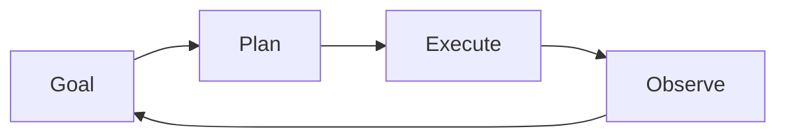

# Contributing to AI Agents Engineering Handbook

First of all, thank you for considering contributing to the **AI Agents Engineering Handbook**.

This project aims to become a comprehensive, community-driven knowledge base for AI Agent design, architecture, implementation, evaluation, security, and governance.

Whether you are an AI Engineer, Researcher, Architect, Developer, Product Manager, or Technology Enthusiast, your contributions are welcome.

---

# Our Mission

The goal of this repository is to:

* Share practical knowledge about AI Agents.
* Document industry best practices.
* Explore emerging Agentic AI patterns.
* Provide reusable frameworks and examples.
* Foster collaboration across the AI community.

---

# Ways to Contribute

There are many ways to contribute to this project.

## Documentation Improvements

Help improve:

* Existing documentation
* Architecture descriptions
* Explanations of concepts
* Examples and tutorials
* Diagrams and visualizations

Examples:

* Clarifying AI Agent concepts
* Improving architecture documentation
* Adding references to research papers

---

## New Content Contributions

You can contribute new content such as:

### Agent Architectures

* Autonomous Agents
* Tool-Augmented Agents
* Multi-Agent Systems
* Hierarchical Agent Models

### Frameworks

* Evaluation Frameworks
* Planning Frameworks
* Governance Models
* Agent Design Patterns

### Examples

* Research Agents
* Coding Agents
* Customer Support Agents
* Testing Agents
* Data Analysis Agents

---

## Research Contributions

We welcome contributions related to:

* Agentic AI Research
* Agent Benchmarks
* Agent Evaluation Techniques
* Agent Memory Systems
* Multi-Agent Collaboration

Please include references whenever possible.

---

## Architecture Diagrams

Visual diagrams significantly improve understanding.

Preferred formats:

* Mermaid
* Draw.io
* Excalidraw
* SVG

Examples:

* Agent workflows
* Multi-agent systems
* Memory architectures
* Tool orchestration flows

---

## Prompt Libraries

Contributions may include:

* System Prompts
* Planning Prompts
* Evaluation Prompts
* Agent Coordination Prompts
* Multi-Agent Collaboration Prompts

Please provide:

* Use case
* Expected outcome
* Limitations

---

# Contribution Process

## Step 1: Fork the Repository

Create a fork of this repository.

```bash
git clone https://github.com/your-username/ai-agents-engineering-handbook.git
```

---

## Step 2: Create a Feature Branch

Create a dedicated branch.

```bash
git checkout -b feature/add-memory-patterns
```

Naming convention:

```text
feature/<feature-name>
bugfix/<issue-name>
docs/<documentation-topic>
```

Examples:

```text
feature/multi-agent-security
docs/reasoning-frameworks
bugfix/diagram-corrections
```

---

## Step 3: Make Changes

Update documentation, examples, frameworks, or diagrams.

Before submitting:

* Verify formatting.
* Validate Mermaid diagrams.
* Check markdown rendering.
* Review technical accuracy.

---

## Step 4: Commit Changes

Use clear commit messages.

Good examples:

```text
Add multi-agent orchestration framework

Improve memory systems documentation

Add evaluation scorecard example
```

Avoid:

```text
Updated file

Fix stuff

Changes
```

---

## Step 5: Submit Pull Request

Create a Pull Request (PR) with:

### Summary

What was changed?

### Motivation

Why is this change valuable?

### References

Any research papers, articles, or standards used.

### Screenshots

Include screenshots when updating diagrams.

---

# Documentation Standards

## Markdown Guidelines

Use:

```markdown
# Heading 1
## Heading 2
### Heading 3
```

Prefer:

* Bullet lists
* Tables
* Diagrams
* Code blocks

---

## Mermaid Diagrams

All diagrams should render correctly.

Example:



---

## Code Examples

Use fenced code blocks.

Example:

````markdown
```python
print("Hello Agent")
```
````

Include comments where necessary.

---

# Research and Citation Guidelines

When contributing research-based content:

Include:

* Original paper title
* Authors
* Publication source
* Publication year

Preferred sources:

* arXiv
* ACM
* IEEE
* OpenAI
* Anthropic
* Google Research
* Microsoft Research

---

# Quality Expectations

Contributions should be:

## Accurate

Information should be technically correct.

## Practical

Focus on real-world applicability.

## Vendor Neutral

Avoid unnecessary promotion of products or services.

## Reproducible

Examples should be understandable and repeatable.

---

# Pull Request Review Criteria

Contributions are reviewed based on:

| Criteria     | Description                  |
| ------------ | ---------------------------- |
| Accuracy     | Technical correctness        |
| Clarity      | Easy to understand           |
| Completeness | Sufficient detail            |
| Relevance    | Aligns with repository goals |
| Quality      | Professional presentation    |

---

# Code of Conduct

We are committed to creating a welcoming and inclusive environment.

Expected behavior:

* Be respectful.
* Be constructive.
* Encourage collaboration.
* Support knowledge sharing.

Unacceptable behavior:

* Harassment
* Personal attacks
* Discrimination
* Spam or self-promotion

---

# Reporting Issues

If you find:

* Incorrect information
* Broken links
* Diagram issues
* Missing references

Please create a GitHub Issue.

Issue template:

```text
Title:
Description:
Steps to Reproduce:
Suggested Fix:
```

---

# Contributor Recognition

We value all contributions.

Contributors may be recognized through:

* Contributor listings
* Release acknowledgements
* Community highlights

Every contribution, whether a typo fix or a major architecture addition, helps improve the handbook.

---

# Future Contribution Areas

We are especially interested in contributions related to:

* Agentic AI
* Multi-Agent Systems
* Agent Memory
* AI Governance
* AI Safety
* AI Security
* Evaluation Frameworks
* Autonomous Workflows
* Enterprise Agent Platforms

---

# Thank You

Thank you for helping build an open-source knowledge resource for the AI community.

Together, we can create a practical and authoritative handbook for designing, building, evaluating, and governing AI Agents.
