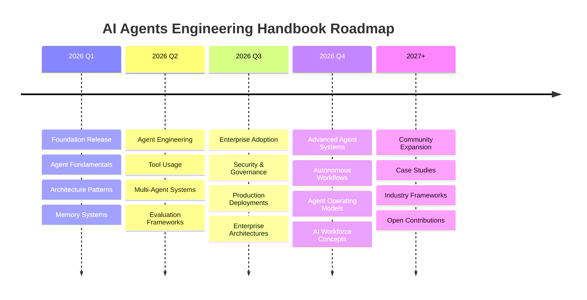

# Roadmap

## AI Agents Engineering Handbook

### Vision

The AI Agents Engineering Handbook aims to become a comprehensive open-source resource for designing, building, evaluating, securing, and governing AI Agent systems.

Our goal is to create a practical and vendor-neutral reference that helps engineers, architects, researchers, and technology leaders understand and implement Agentic AI systems at scale.

---

# Repository Evolution

---

# Phase 1 – Foundation

## Goal

Establish core AI Agent engineering concepts and architecture patterns.

### Deliverables

* [x] Repository setup
* [x] Project structure
* [ ] Introduction to AI Agents
* [ ] Agent Fundamentals
* [ ] Agent Architecture Patterns
* [ ] Planning and Reasoning
* [ ] Memory Systems

### Success Criteria

* Core documentation published
* Foundational diagrams completed
* Community review initiated

---

# Phase 2 – Agent Engineering

## Goal

Document practical engineering techniques used to build AI Agents.

### Deliverables

* [ ] Tool Usage and Function Calling
* [ ] Agent Planning Frameworks
* [ ] Prompt Engineering Patterns
* [ ] Multi-Agent Systems
* [ ] Agent Collaboration Models
* [ ] Orchestration Frameworks

### New Artifacts

* Architecture diagrams
* Prompt libraries
* Example workflows
* Evaluation templates

### Success Criteria

* Practical implementation guidance available
* Reference architectures documented
* Example agents published

---

# Phase 3 – Enterprise AI Agents

## Goal

Address real-world enterprise deployment challenges.

### Deliverables

* [ ] Security and Safety Frameworks
* [ ] Governance Models
* [ ] Compliance Considerations
* [ ] Enterprise Agent Platforms
* [ ] Production Operations
* [ ] Monitoring and Observability

### Enterprise Topics

* Risk Management
* Auditability
* Human-in-the-Loop Controls
* Data Governance
* Agent Access Management

### Success Criteria

* Enterprise reference architecture published
* Governance framework completed
* Security guidance documented

---

# Phase 4 – Advanced Agent Systems

## Goal

Explore emerging Agentic AI patterns and advanced system design.

### Deliverables

* [ ] Autonomous Workflows
* [ ] AI Agent Teams
* [ ] Agent Operating Systems
* [ ] Self-Improving Agents
* [ ] Agent Marketplaces
* [ ] Agent Collaboration Standards

### Research Areas

* Reflection Loops
* Self-Correction
* Long-Term Memory
* Agent Coordination
* Agent Societies

### Success Criteria

* Advanced architecture patterns published
* Research references added
* Community case studies included

---

# Phase 5 – Industry-Specific Agent Frameworks

## Goal

Provide practical examples across industries.

### Planned Examples

#### Software Engineering

* Coding Agent
* Testing Agent
* DevOps Agent
* Documentation Agent

#### Financial Services

* Fraud Detection Agent
* Risk Analysis Agent
* Customer Service Agent

#### Healthcare

* Clinical Research Agent
* Patient Support Agent
* Compliance Agent

#### Retail

* Recommendation Agent
* Inventory Agent
* Customer Support Agent

#### Education

* Learning Assistant
* Research Assistant
* Knowledge Tutor

### Success Criteria

* Industry examples published
* Architecture patterns documented
* Prompt libraries expanded

---

# Phase 6 – Evaluation and Benchmarking

## Goal

Develop objective frameworks for measuring agent quality.

### Deliverables

* [ ] Agent Evaluation Framework
* [ ] Agent Quality Scorecard
* [ ] Performance Benchmarks
* [ ] Safety Assessment Framework
* [ ] Cost Optimization Framework

### Metrics

| Category    | Example Metrics      |
| ----------- | -------------------- |
| Accuracy    | Task completion rate |
| Reliability | Consistency score    |
| Efficiency  | Response time        |
| Safety      | Policy adherence     |
| Cost        | Token consumption    |

### Success Criteria

* Standardized evaluation model
* Benchmarking methodology
* Community contributions

---

# Community Roadmap

## Short-Term

* Improve documentation quality
* Expand diagrams
* Add more examples
* Refine architecture guides

## Medium-Term

* Publish agent design patterns
* Add implementation examples
* Introduce benchmarking frameworks

## Long-Term

* Become a recognized AI Agent knowledge repository
* Support industry collaboration
* Foster open-source contributions

---

# Future Topics Under Consideration

## Agent Memory

* Episodic Memory
* Semantic Memory
* Memory Compression
* Knowledge Retention

## Agent Reasoning

* Chain of Thought
* Tree of Thought
* ReAct
* Reflection
* Debate Frameworks

## Agent Collaboration

* Swarm Intelligence
* Agent Teams
* Distributed Agents
* Agent Negotiation Models

## Agent Security

* Prompt Injection Defense
* Tool Security
* Memory Protection
* Agent Governance

---

# Community Contributions Needed

We welcome contributions in the following areas:

* Documentation
* Research Reviews
* Architecture Diagrams
* Agent Examples
* Evaluation Frameworks
* Security Guidance
* Industry Use Cases

See `CONTRIBUTING.md` for details.

---

# Success Metrics

The project will measure success using:

### Community Metrics

* Contributors
* Pull Requests
* Discussions
* Stars
* Forks

### Content Metrics

* Documentation Coverage
* Architecture Examples
* Prompt Libraries
* Research References

### Quality Metrics

* Technical Accuracy
* Practical Applicability
* Community Feedback

---

# Long-Term Vision

We envision this repository evolving into a trusted, community-driven handbook for Agentic AI engineering.

As AI Agents become a foundational technology across industries, this project aims to provide engineers and organizations with the frameworks, patterns, examples, and best practices needed to design responsible, secure, and effective AI Agent systems.

The journey is just beginning, and contributions from the community will help shape the future of this handbook.
