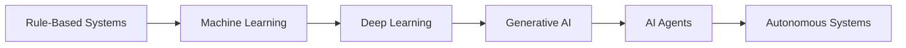
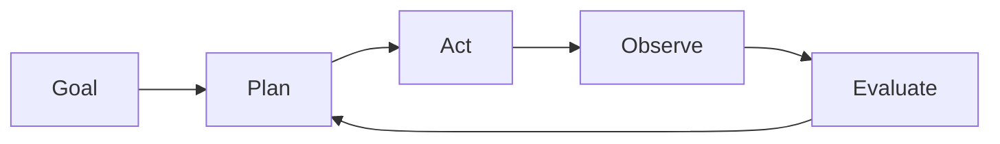
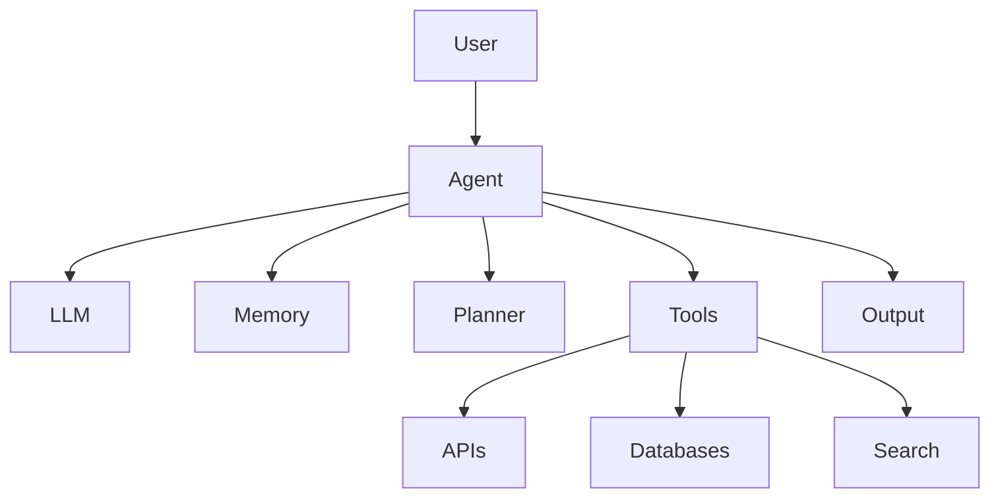

# Introduction to AI Agents

## Overview

Artificial Intelligence is undergoing a significant transformation. While Large Language Models (LLMs) have demonstrated remarkable capabilities in generating text, answering questions, writing code, and summarizing information, they are inherently limited to responding to prompts.

The next evolution of AI is the emergence of **AI Agents**—autonomous, goal-driven systems capable of reasoning, planning, acting, and learning through interaction with their environment.

AI Agents extend the capabilities of traditional LLMs by integrating memory, planning mechanisms, tools, and feedback loops, enabling them to perform complex tasks with minimal human intervention.

This handbook explores the principles, architectures, frameworks, and engineering practices required to design, build, evaluate, and govern AI Agent systems.

---

# The Evolution of Intelligent Systems

The journey toward Agentic AI can be viewed as a progression through several generations of computing paradigms.



## Rule-Based Systems

Traditional software applications operate using predefined rules and deterministic logic.

Characteristics:

* Predictable behavior
* Explicit programming
* Limited adaptability
* Human-driven decision making

Examples:

* Business workflows
* Decision trees
* Expert systems

---

## Machine Learning Systems

Machine Learning introduced the ability to learn patterns from data.

Characteristics:

* Data-driven predictions
* Statistical learning
* Pattern recognition

Examples:

* Fraud detection
* Recommendation systems
* Image classification

---

## Generative AI

Generative AI introduced systems capable of creating content and interacting using natural language.

Characteristics:

* Human-like communication
* Content generation
* Knowledge synthesis

Examples:

* Chatbots
* Code assistants
* Content creation tools

---

## AI Agents

AI Agents move beyond content generation and become capable of performing actions autonomously.

Characteristics:

* Goal-oriented behavior
* Reasoning and planning
* Tool utilization
* Memory retention
* Autonomous execution

Examples:

* Research Agents
* Software Engineering Agents
* Customer Service Agents
* Business Process Agents

---

# What Is an AI Agent?

An AI Agent is an intelligent software entity that can perceive information, reason about goals, take actions, and learn from outcomes to achieve desired objectives.

Unlike traditional chatbots, AI Agents are designed to execute tasks rather than simply generate responses.

An AI Agent typically includes:

* A reasoning engine
* Memory capabilities
* Planning mechanisms
* Tool integrations
* Feedback loops
* Decision-making logic

---

# Core Characteristics of AI Agents

## 1. Goal-Oriented

Agents operate with clear objectives.

Example:

```text
Goal:
Generate a competitive analysis report for the AI Agent market.
```

The agent determines the steps required to achieve the goal.

---

## 2. Autonomous

Agents can make decisions and perform actions without continuous user guidance.

Example:

* Search for information
* Analyze data
* Generate insights
* Produce reports

---

## 3. Context-Aware

Agents maintain awareness of:

* User preferences
* Previous interactions
* Environmental conditions
* Business context

This enables more relevant decision making.

---

## 4. Tool-Enabled

Modern AI Agents interact with external systems.

Examples:

* APIs
* Databases
* Search engines
* Knowledge repositories
* Code execution environments

Tool usage significantly expands an agent's capabilities.

---

## 5. Memory-Driven

Agents use memory to retain knowledge and context.

Types of memory include:

### Short-Term Memory

Maintains context within a conversation or task.

### Long-Term Memory

Stores information across sessions.

### Episodic Memory

Remembers specific events and interactions.

### Semantic Memory

Stores factual knowledge and concepts.

---

# The Agent Lifecycle

A typical AI Agent operates through a continuous cycle of planning, execution, and learning.



---

## Step 1: Goal Definition

The agent receives an objective.

Example:

```text
Analyze customer support tickets and identify common issues.
```

---

## Step 2: Planning

The agent determines the sequence of actions required.

Example:

1. Retrieve ticket data
2. Categorize tickets
3. Identify recurring themes
4. Generate summary

---

## Step 3: Action Execution

The agent performs tasks using available tools.

Examples:

* Database queries
* API calls
* Document retrieval
* Data analysis

---

## Step 4: Observation

The agent evaluates results.

Questions include:

* Was the task successful?
* Is additional information required?
* Are corrective actions needed?

---

## Step 5: Evaluation and Iteration

The agent refines its approach based on outcomes and feedback.

This creates a continuous improvement loop.

---

# Key Components of an AI Agent

Most AI Agent architectures contain several fundamental building blocks.



---

## Large Language Model (LLM)

Provides reasoning, language understanding, and decision support.

Examples include:

* GPT models
* Claude models
* Gemini models
* Open-source LLMs

---

## Planner

Responsible for:

* Goal decomposition
* Task sequencing
* Decision making

---

## Memory Layer

Stores:

* Context
* Historical interactions
* Learned information

---

## Tool Layer

Provides access to external capabilities.

Examples:

* Search tools
* Databases
* Enterprise systems
* Code execution environments

---

# Real-World Applications

AI Agents are being adopted across multiple industries.

## Software Engineering

Examples:

* Code generation
* Code review
* Testing automation
* Documentation creation

---

## Customer Support

Examples:

* Automated ticket resolution
* Knowledge retrieval
* Customer interactions

---

## Healthcare

Examples:

* Clinical research assistance
* Medical documentation
* Patient support systems

---

## Financial Services

Examples:

* Fraud detection
* Risk analysis
* Compliance monitoring

---

## Research and Knowledge Management

Examples:

* Literature reviews
* Competitive intelligence
* Market analysis

---

# Benefits of AI Agents

Organizations are investing in Agentic AI because of several key advantages.

| Benefit              | Description             |
| -------------------- | ----------------------- |
| Automation           | Reduces manual effort   |
| Scalability          | Handles large workloads |
| Consistency          | Standardized execution  |
| Speed                | Faster task completion  |
| Cost Efficiency      | Improves productivity   |
| Continuous Operation | Available 24/7          |

---

# Challenges and Risks

Despite their potential, AI Agents introduce new challenges.

## Hallucinations

Agents may generate inaccurate information.

## Security Risks

Examples:

* Prompt injection
* Data leakage
* Unauthorized actions

## Governance

Organizations must establish:

* Policies
* Controls
* Audit mechanisms

## Reliability

Agent behavior can be non-deterministic and difficult to predict.

---

# Why This Handbook Matters

As AI Agents become foundational components of modern software ecosystems, organizations need structured engineering guidance to build reliable, secure, and scalable Agent systems.

This handbook aims to bridge the gap between research and practical implementation by providing:

* Architectural patterns
* Design frameworks
* Evaluation techniques
* Security guidance
* Real-world examples
* Industry best practices

Whether you are building your first AI Agent or designing enterprise-scale Agent platforms, understanding the principles outlined in this handbook will help you navigate the rapidly evolving landscape of Agentic AI.

---

# Next Steps

In the next chapter, **Agent Fundamentals**, we will explore the core building blocks of AI Agents, including reasoning engines, memory systems, planning mechanisms, and tool integrations that enable autonomous behavior.
