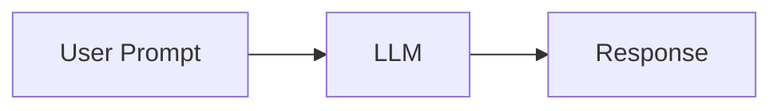
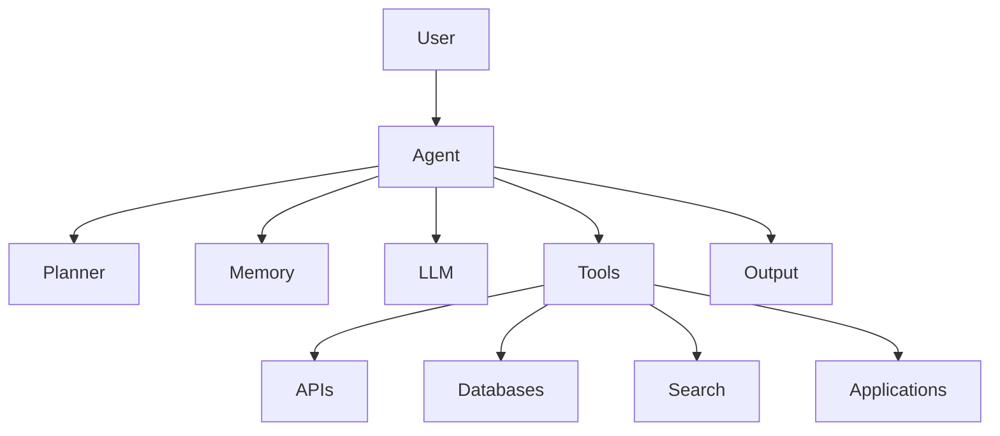
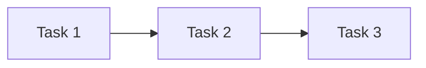
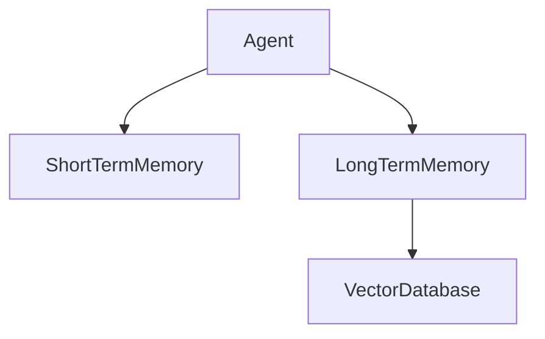
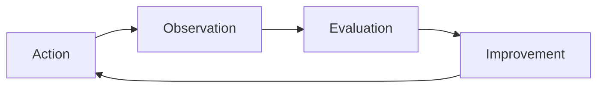
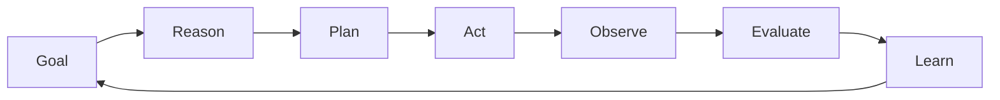

# Agent Fundamentals

## Overview

Artificial Intelligence Agents are autonomous software systems capable of perceiving information, reasoning about goals, making decisions, and taking actions to achieve desired outcomes.

While Large Language Models (LLMs) provide the intelligence layer for understanding and generating content, AI Agents combine multiple components such as planning, memory, tools, and feedback mechanisms to perform complex tasks autonomously.

Understanding these foundational building blocks is essential for designing scalable, reliable, and production-ready Agentic AI systems.

---

# What Makes an AI Agent Different?

Traditional AI systems are typically reactive. They receive input and generate output.

AI Agents go beyond simple interactions by:

* Understanding objectives
* Creating execution plans
* Using external tools
* Learning from observations
* Adapting behavior dynamically

---

## Traditional LLM Workflow



The model generates a response but does not take actions.

---

## AI Agent Workflow


The agent actively works toward completing a goal.

---

# Core Components of an AI Agent

Modern AI Agents consist of multiple interconnected components.



---

# 1. Large Language Model (LLM)

The LLM acts as the cognitive engine of the agent.

Responsibilities include:

* Understanding natural language
* Reasoning about tasks
* Generating responses
* Interpreting tool outputs

---

## Example

User Goal:

```text
Find the latest developments in AI Agents and summarize them.
```

The LLM determines:

* What information is needed
* Which tools should be used
* How results should be presented

---

## Limitations of LLMs

LLMs alone cannot:

* Access real-time data
* Execute external actions
* Persist memory reliably
* Interact with enterprise systems

These limitations are addressed through additional agent components.

---

# 2. Planning Engine

Planning enables agents to break complex goals into manageable tasks.

---

## Goal Example

```text
Create a competitive analysis report on AI Agent platforms.
```

Instead of solving everything at once, the agent creates a plan:

1. Identify leading platforms
2. Gather information
3. Compare capabilities
4. Generate insights
5. Produce final report

---

## Planning Types

### Reactive Planning

Responds immediately.

Example:

```text
User asks a question.
Agent answers.
```

---

### Sequential Planning

Tasks executed in order.



---

### Dynamic Planning

Plan evolves based on observations.


---

# 3. Memory System

Memory enables agents to retain knowledge and context.

Without memory, agents start every interaction from scratch.

---

# Types of Memory

## Short-Term Memory

Stores temporary context.

Examples:

* Current conversation
* Active task information
* Session state

---

## Long-Term Memory

Stores information across sessions.

Examples:

* User preferences
* Historical interactions
* Organizational knowledge

---

## Episodic Memory

Stores specific experiences.

Example:

```text
The agent remembers solving a similar problem last week.
```

---

## Semantic Memory

Stores structured knowledge.

Example:

```text
AI Agents use planning and reasoning to achieve goals.
```

---

## Memory Architecture



---

# 4. Tool Layer

Tools allow agents to interact with the external world.

Without tools, agents are limited to their training data.

---

## Common Tool Categories

| Tool Type      | Purpose                 |
| -------------- | ----------------------- |
| Search         | Retrieve information    |
| Database       | Query data              |
| API            | Access external systems |
| Calculator     | Perform calculations    |
| Code Execution | Run code                |
| File Systems   | Read and write files    |

---

## Example

User Goal:

```text
Analyze current stock market trends.
```

Agent Workflow:

1. Search financial news
2. Retrieve market data
3. Analyze information
4. Generate report

Without tools, the agent cannot access live data.

---

# 5. Execution Engine

The execution engine performs planned actions.

Responsibilities include:

* Task execution
* Tool invocation
* Error handling
* Workflow coordination

---

## Example Workflow


---

# 6. Observation and Feedback

Agents continuously monitor outcomes.

Questions include:

* Did the action succeed?
* Was the goal achieved?
* Is additional information required?

---

## Feedback Loop



---

# Agent Capabilities

The combination of the above components enables advanced capabilities.

---

## Reasoning

Agents evaluate information and make decisions.

Example:

```text
Identify the most relevant source from multiple search results.
```

---

## Planning

Agents create execution strategies.

Example:

```text
Generate a project plan for software migration.
```

---

## Tool Usage

Agents leverage external systems.

Example:

```text
Query a CRM system to retrieve customer information.
```

---

## Adaptation

Agents modify behavior based on feedback.

Example:

```text
Change search strategy when initial results are insufficient.
```

---

## Learning

Some agent architectures incorporate learning mechanisms.

Examples:

* Reinforcement learning
* Human feedback
* Memory-based improvement

---

# Types of AI Agents

Several categories of agents exist.

---

## Reactive Agents

Characteristics:

* No memory
* Immediate responses
* Simple decision-making

Use Cases:

* Chatbots
* FAQ Assistants

---

## Deliberative Agents

Characteristics:

* Planning capabilities
* Goal decomposition
* Multi-step execution

Use Cases:

* Research agents
* Data analysis agents

---

## Tool-Augmented Agents

Characteristics:

* External tool integration
* Real-time information access

Use Cases:

* Coding agents
* Enterprise assistants

---

## Multi-Agent Systems

Characteristics:

* Multiple specialized agents
* Collaborative execution

Use Cases:

* Complex enterprise workflows
* Autonomous teams

---

# Agent Lifecycle

The lifecycle of an AI Agent consists of multiple stages.



---

## Lifecycle Stages

### Goal

Define objective.

### Reason

Understand context and constraints.

### Plan

Create execution strategy.

### Act

Execute actions.

### Observe

Monitor outcomes.

### Evaluate

Assess effectiveness.

### Learn

Store useful information.

---

# Design Principles for AI Agents

Successful AI Agents follow several key principles.

---

## Modularity

Separate:

* Planning
* Memory
* Tools
* Execution

---

## Scalability

Support increasing workloads and complexity.

---

## Explainability

Provide visibility into decisions and actions.

---

## Security

Protect data, tools, and systems.

---

## Reliability

Ensure consistent behavior.

---

# Challenges in Agent Design

Despite their power, AI Agents face significant challenges.

---

## Hallucinations

Agents may generate incorrect information.

---

## Tool Failures

External systems may become unavailable.

---

## Context Overload

Large memory stores can reduce performance.

---

## Security Risks

Examples include:

* Prompt injection
* Data leakage
* Unauthorized tool access

---

## Cost Management

Agent workflows can consume significant compute resources.

---

# Key Takeaways

AI Agents extend traditional language models by combining intelligence, planning, memory, tools, and feedback mechanisms into autonomous systems capable of achieving complex goals.

The foundational building blocks of an AI Agent include:

* Large Language Models
* Planning Engines
* Memory Systems
* Tool Integrations
* Execution Engines
* Feedback Loops

Understanding these components is critical for designing reliable, scalable, and enterprise-ready Agentic AI solutions.

---

# Next Chapter

In the next chapter, **Agent Architecture Patterns**, we will explore common architectural approaches used to build AI Agents, including single-agent systems, tool-augmented agents, memory-driven agents, and multi-agent ecosystems.
