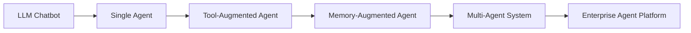
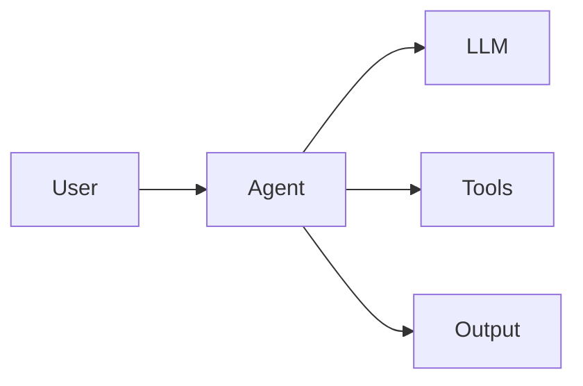

# Agent Architecture Patterns

## Overview

As AI Agents evolve from simple assistants to autonomous systems capable of reasoning, planning, and executing complex workflows, architecture becomes a critical design consideration.

An Agent Architecture defines how an AI Agent organizes its intelligence, memory, tools, decision-making processes, and interactions with external systems.

Selecting the appropriate architecture directly impacts:

* Scalability
* Reliability
* Performance
* Maintainability
* Security
* Cost efficiency

This chapter explores the most common architecture patterns used in modern Agentic AI systems.

---

# Why Agent Architecture Matters

A well-designed architecture enables agents to:

* Handle complex workflows
* Scale efficiently
* Collaborate effectively
* Integrate with enterprise systems
* Support governance and security controls

Poor architecture choices can result in:

* Limited scalability
* Increased costs
* Security vulnerabilities
* Unreliable outcomes
* Difficult maintenance

---

# Architecture Evolution



---

# Core Architectural Components

Most agent architectures are built using a common set of foundational components.

```mermaid
flowchart TD

User

User --> Agent

Agent --> Planner

Agent --> Memory

Agent --> LLM

Agent --> Tool Layer

Tool Layer --> APIs

Tool Layer --> Databases

Tool Layer --> Enterprise Systems

Agent --> Output
```

---

# Architecture Pattern 1: Single Agent Architecture

## Overview

The Single Agent pattern consists of a single intelligent agent responsible for handling an entire workflow.

This is the simplest and most commonly used architecture.

---

## Architecture Diagram



---

## Characteristics

* Single reasoning engine
* Centralized decision-making
* Minimal coordination overhead
* Easier implementation

---

## Advantages

✅ Simple design

✅ Faster deployment

✅ Lower operational complexity

✅ Suitable for small projects

---

## Limitations

❌ Limited scalability

❌ Context overload

❌ Single point of failure

❌ Difficult to handle complex workflows

---

## Example Use Cases

* Personal assistants
* FAQ bots
* Research assistants
* Internal productivity tools

---

# Architecture Pattern 2: Tool-Augmented Agent

## Overview

A Tool-Augmented Agent extends an LLM by integrating external tools and services.

This architecture significantly expands agent capabilities.

---

## Architecture Diagram

```mermaid
flowchart TD

User
--> Agent

Agent
--> LLM

Agent
--> Tool Router

Tool Router --> Search API

Tool Router --> Database

Tool Router --> Calculator

Tool Router --> CRM

Tool Router --> ERP

Agent --> Response
```

---

## Characteristics

* External system integration
* Real-time information retrieval
* Action execution capability

---

## Advantages

✅ Access to live data

✅ Enterprise integration

✅ Expanded functionality

✅ Better task completion rates

---

## Limitations

❌ Tool failures impact execution

❌ Increased complexity

❌ Security considerations

---

## Example Use Cases

* Coding assistants
* Customer support agents
* Enterprise workflow agents
* Financial analysis agents

---

# Architecture Pattern 3: Memory-Augmented Agent

## Overview

Memory-Augmented Agents maintain historical context and knowledge across interactions.

Memory transforms stateless LLMs into context-aware systems.

---

## Architecture Diagram

mermaid
flowchart TD

User

User --> Agent

Agent --> LLM

Agent --> Short-Term Memory

Agent --> Long-Term Memory

Long-Term Memory --> Vector Database

Agent --> Tools

Agent --> Response
```

---

## Memory Types

### Short-Term Memory

Stores:

* Active conversation context
* Current task information

---

### Long-Term Memory

Stores:

* User preferences
* Historical interactions
* Organizational knowledge

---

## Advantages

✅ Personalized experiences

✅ Improved decision-making

✅ Context retention

✅ Learning from interactions

---

## Limitations

❌ Memory management complexity

❌ Storage costs

❌ Privacy considerations

---

## Example Use Cases

* Personal AI assistants
* Enterprise knowledge agents
* Learning systems
* Customer relationship agents

---

# Architecture Pattern 4: Planner-Executor Architecture

## Overview

This architecture separates planning from execution.

One component develops the strategy while another performs actions.

---

## Architecture Diagram

```mermaid
flowchart TD

User
--> Planner

Planner
--> Execution Plan

Execution Plan
--> Executor

Executor
--> Tools

Tools
--> Results

Results
--> Planner
```

---

## Characteristics

* Goal decomposition
* Structured execution
* Feedback-driven planning

---

## Advantages

✅ Better handling of complex tasks

✅ Improved transparency

✅ Easier debugging

---

## Limitations

❌ Additional latency

❌ More components to manage

---

## Example Use Cases

* Research automation
* Software development agents
* Business process automation

---

# Architecture Pattern 5: Multi-Agent Architecture

## Overview

Multiple specialized agents collaborate to solve complex problems.

Each agent has a specific responsibility.

---

## Architecture Diagram

```mermaid
flowchart TD

User

User --> Manager Agent

Manager Agent --> Research Agent

Manager Agent --> Analysis Agent

Manager Agent --> Writing Agent

Research Agent --> Shared Memory

Analysis Agent --> Shared Memory

Writing Agent --> Shared Memory

Manager Agent --> Final Output
```

---

## Characteristics

* Specialized agents
* Shared objectives
* Coordinated execution

---

## Advantages

✅ Scalability

✅ Domain specialization

✅ Better quality outputs

✅ Parallel processing

---

## Limitations

❌ Coordination overhead

❌ Increased complexity

❌ Higher infrastructure costs

---

## Example Use Cases

* Enterprise automation
* Large-scale research
* Complex analytics workflows

---

# Architecture Pattern 6: Hierarchical Agent Systems

## Overview

Agents are organized into management layers similar to organizational structures.

---

## Architecture Diagram

```mermaid
flowchart TD

Executive Agent

Executive Agent
--> Planning Agent

Executive Agent
--> Operations Agent

Planning Agent
--> Research Agent

Planning Agent
--> Analysis Agent

Operations Agent
--> Execution Agent

Operations Agent
--> Monitoring Agent
```

---

## Characteristics

* Delegation
* Supervision
* Layered decision making

---

## Advantages

✅ Handles highly complex workflows

✅ Clear responsibilities

✅ Strong governance

---

## Limitations

❌ Significant orchestration complexity

❌ Increased latency

---

## Example Use Cases

* Autonomous enterprises
* Digital workforce platforms
* Large-scale business operations

---

# Architecture Pattern 7: Event-Driven Agent Architecture

## Overview

Agents respond dynamically to events generated by systems or users.

---

## Architecture Diagram

```mermaid
flowchart LR

Event Source

Event Source
--> Event Bus

Event Bus
--> Agent

Agent
--> Action

Action
--> External System
```

---

## Examples of Events

* Customer submits ticket
* Payment failure
* Security alert
* System outage

---

## Advantages

✅ Near real-time response

✅ High scalability

✅ Suitable for enterprise environments

---

## Example Use Cases

* Incident management
* Fraud detection
* Monitoring systems

---

# Architecture Comparison

| Pattern          | Complexity | Scalability | Best For                 |
| ---------------- | ---------- | ----------- | ------------------------ |
| Single Agent     | Low        | Low         | Simple applications      |
| Tool-Augmented   | Medium     | Medium      | Enterprise integrations  |
| Memory-Augmented | Medium     | Medium      | Personalized experiences |
| Planner-Executor | Medium     | High        | Complex workflows        |
| Multi-Agent      | High       | High        | Large-scale automation   |
| Hierarchical     | Very High  | Very High   | Enterprise operations    |
| Event-Driven     | High       | Very High   | Real-time systems        |

---

# Architecture Selection Framework

When choosing an architecture, consider:

---

## Complexity

How sophisticated is the task?

### Low Complexity

Use:

* Single Agent

### Medium Complexity

Use:

* Tool-Augmented Agent
* Memory-Augmented Agent

### High Complexity

Use:

* Planner-Executor
* Multi-Agent Systems

---

## Scalability Requirements

How many users or workflows must be supported?

### Small Teams

Single Agent

### Enterprise Scale

Multi-Agent Platform

---

## Governance Requirements

Highly regulated environments may require:

* Human-in-the-loop controls
* Audit logging
* Agent supervision

---

# Enterprise Reference Architecture

Modern enterprises increasingly adopt layered agent architectures.

```mermaid
flowchart TD

Users

Users --> Agent Layer

Agent Layer --> Orchestration Layer

Orchestration Layer --> Tool Layer

Tool Layer --> Enterprise Systems

Tool Layer --> Databases

Tool Layer --> APIs

Orchestration Layer --> Memory Layer

Memory Layer --> Vector Store

Agent Layer --> Monitoring Layer

Monitoring Layer --> Governance Layer
```

---

# Design Principles

Successful agent architectures typically follow these principles.

---

## Modularity

Separate responsibilities across components.

---

## Observability

Monitor:

* Decisions
* Tool usage
* Costs
* Failures

---

## Security

Protect:

* Data
* APIs
* Memory stores

---

## Scalability

Support future growth.

---

## Reliability

Design for failure recovery.

---

# Key Takeaways

AI Agent architectures have evolved significantly beyond traditional chatbot models.

The most common patterns include:

* Single Agent Systems
* Tool-Augmented Agents
* Memory-Augmented Agents
* Planner-Executor Architectures
* Multi-Agent Systems
* Hierarchical Agent Platforms
* Event-Driven Agents

Choosing the right architecture depends on:

* Business objectives
* Complexity
* Scalability requirements
* Governance needs
* Operational constraints

Understanding these architecture patterns provides the foundation for designing robust, scalable, and enterprise-ready Agentic AI solutions.

---

# Next Chapter

In the next chapter, **Planning and Reasoning**, we will explore how AI Agents think, make decisions, decompose goals, and execute complex workflows using advanced reasoning techniques such as Chain of Thought, Tree of Thoughts, ReAct, Reflection, and Self-Correction.
