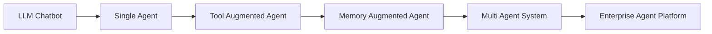
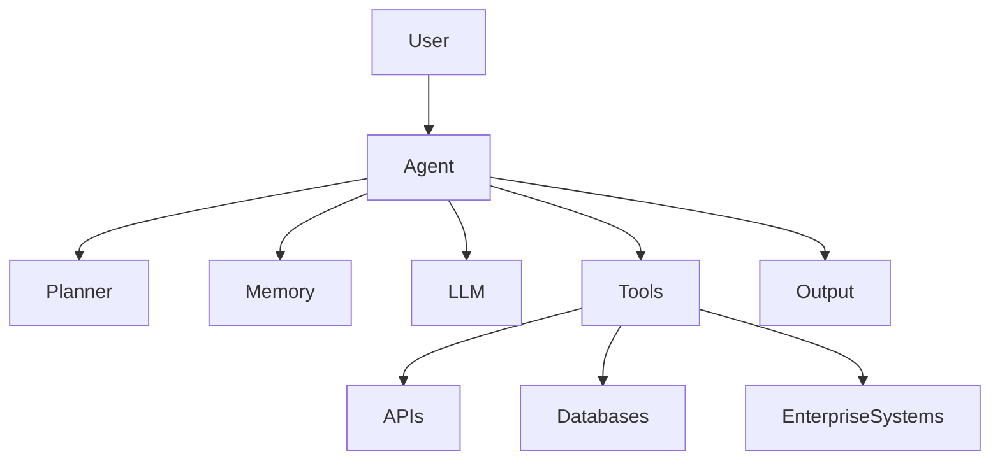
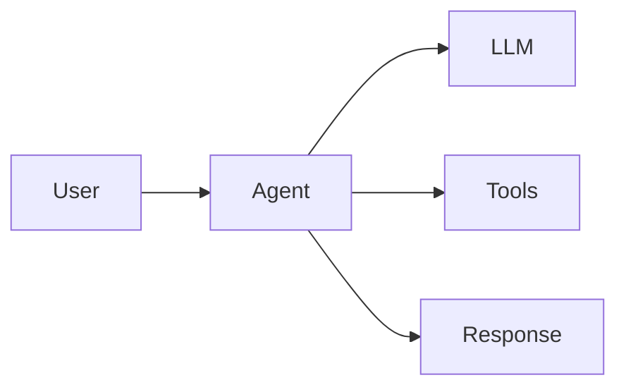
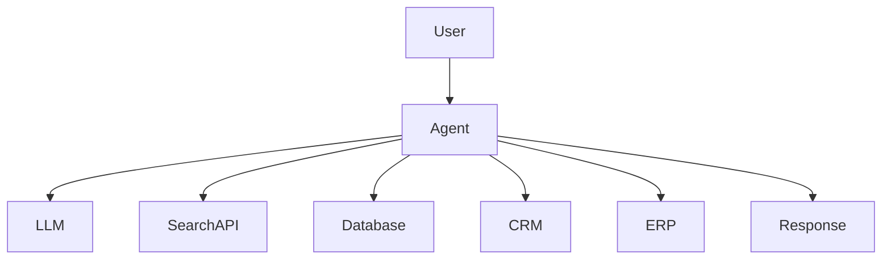
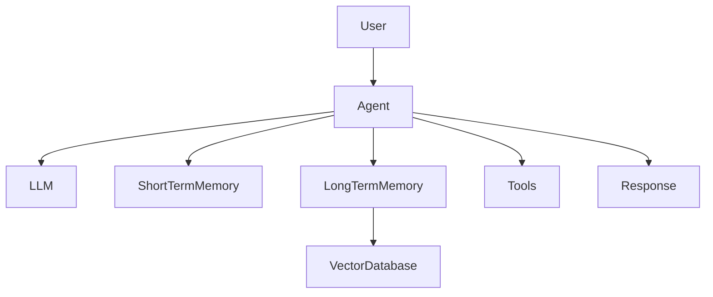
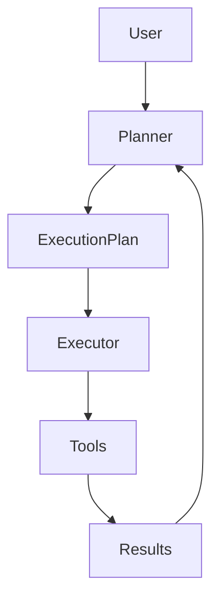
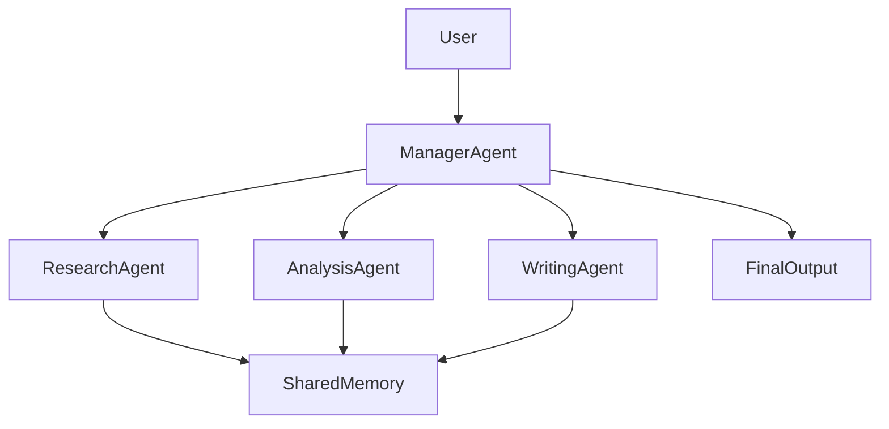
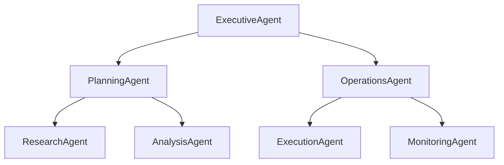
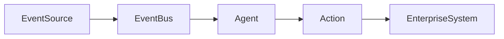
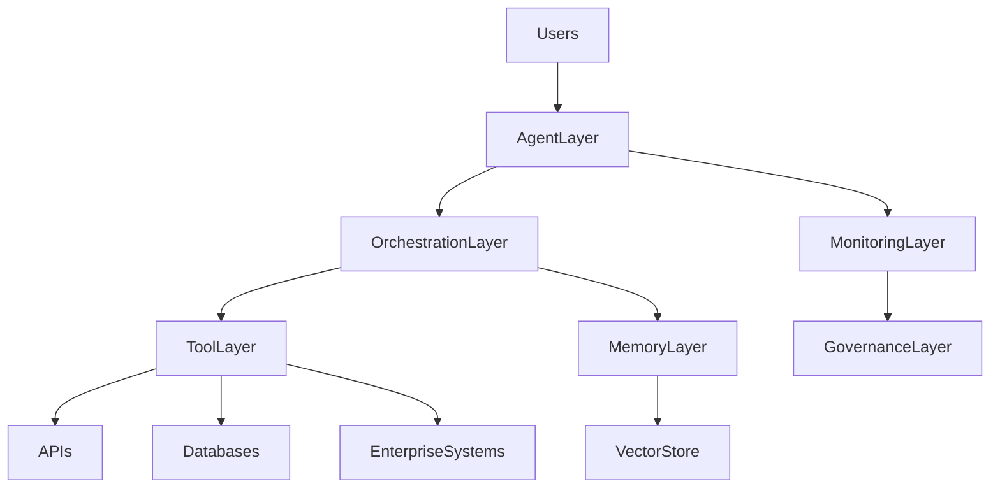

# Agent Architecture Patterns

## Overview

As AI Agents evolve from simple conversational assistants to autonomous systems capable of reasoning, planning, memory management, and tool execution, architecture becomes a critical success factor.

Agent architecture defines how components such as Large Language Models (LLMs), memory systems, planning engines, tools, and orchestration layers interact to achieve goals.

Selecting the appropriate architecture impacts:

* Scalability
* Reliability
* Security
* Cost
* Maintainability
* Performance

This chapter explores the most common architecture patterns used in modern Agentic AI systems.

---

# Why Agent Architecture Matters

A well-designed architecture enables AI Agents to:

* Solve complex problems
* Scale efficiently
* Integrate with enterprise systems
* Support governance and security requirements
* Collaborate with other agents

Poor architecture decisions often lead to:

* Limited scalability
* Increased operational costs
* Security risks
* Unpredictable behavior
* Difficult maintenance

---

# Evolution of Agent Architectures

---

# Core Architectural Components

Most AI Agent architectures are built using a common set of foundational components.

## Component Description

| Component          | Purpose                                       |
| ------------------ | --------------------------------------------- |
| User               | Provides goals and instructions               |
| Agent              | Central orchestration layer                   |
| LLM                | Performs reasoning and language understanding |
| Planner            | Creates execution plans                       |
| Memory             | Stores context and knowledge                  |
| Tools              | Connects to external capabilities             |
| APIs               | Accesses external services                    |
| Databases          | Retrieves structured information              |
| Enterprise Systems | Integrates with business platforms            |
| Output             | Delivers final results                        |

---

# Architecture Pattern 1: Single Agent Architecture

## Overview

A Single Agent architecture consists of one intelligent agent responsible for handling the complete workflow.

### Architecture

### Characteristics

* Centralized decision making
* Simple implementation
* Minimal coordination

### Advantages

* Easy to build
* Low operational complexity
* Faster deployment

### Limitations

* Limited scalability
* Context overload
* Single point of failure

### Common Use Cases

* Personal assistants
* Chatbots
* Internal productivity tools
* Research assistants

---

# Architecture Pattern 2: Tool-Augmented Agent

## Overview

Tool-Augmented Agents extend LLM capabilities by connecting to external systems.

### Architecture

### Advantages

* Real-time information access
* Enterprise integration
* Action execution capability

### Limitations

* Tool dependency
* Security considerations
* Increased complexity

### Common Use Cases

* Coding assistants
* Customer support agents
* Business process automation

---

# Architecture Pattern 3: Memory-Augmented Agent

## Overview

Memory-Augmented Agents maintain context across tasks and interactions.

### Architecture

### Memory Types

#### Short-Term Memory

Stores:

* Active conversations
* Current task context

#### Long-Term Memory

Stores:

* User preferences
* Historical interactions
* Organizational knowledge

### Advantages

* Personalized experiences
* Improved context retention
* Better decision making

### Common Use Cases

* Knowledge assistants
* Enterprise copilots
* Learning systems

---

# Architecture Pattern 4: Planner-Executor Architecture

## Overview

Separates planning from execution.

One component creates plans while another executes them.

### Architecture

### Advantages

* Better task decomposition
* Improved transparency
* Easier debugging

### Common Use Cases

* Research automation
* Software development agents
* Business workflows

---

# Architecture Pattern 5: Multi-Agent Architecture

## Overview

Multiple specialized agents collaborate toward a shared objective.

### Architecture

### Advantages

* Parallel processing
* Domain specialization
* Higher scalability

### Challenges

* Coordination overhead
* Increased infrastructure costs
* Complex orchestration

### Common Use Cases

* Enterprise automation
* Research platforms
* Autonomous teams

---

# Architecture Pattern 6: Hierarchical Agent Architecture

## Overview

Agents are organized into management layers similar to human organizations.

### Architecture

### Advantages

* Strong governance
* Clear accountability
* Supports large-scale operations

### Common Use Cases

* Enterprise agent platforms
* Digital workforce systems

---

# Architecture Pattern 7: Event-Driven Agent Architecture

## Overview

Agents react to system-generated events.

### Architecture

### Example Events

* Payment failure
* Customer ticket creation
* Security alerts
* System incidents

### Common Use Cases

* Fraud detection
* Monitoring systems
* Incident response

---

# Architecture Comparison

| Architecture Pattern | Complexity | Scalability | Best Use Cases          |
| -------------------- | ---------- | ----------- | ----------------------- |
| Single Agent         | Low        | Low         | Chatbots, assistants    |
| Tool-Augmented       | Medium     | Medium      | Enterprise integrations |
| Memory-Augmented     | Medium     | Medium      | Personalized assistants |
| Planner-Executor     | Medium     | High        | Complex workflows       |
| Multi-Agent          | High       | High        | Large-scale automation  |
| Hierarchical         | Very High  | Very High   | Enterprise operations   |
| Event-Driven         | High       | Very High   | Real-time systems       |

---

# Architecture Selection Framework

## Use a Single Agent When

* Requirements are simple
* Limited workflows exist
* Fast implementation is required

## Use Tool-Augmented Agents When

* External systems must be accessed
* Real-time information is needed

## Use Memory-Augmented Agents When

* Context retention is important
* User personalization is required

## Use Multi-Agent Systems When

* Workflows are complex
* Specialized expertise is required
* Scalability is a priority

---

# Enterprise Reference Architecture

---

# Design Principles

Successful Agent architectures should follow these principles:

## Modularity

Separate responsibilities into independent components.

## Scalability

Support increasing workloads and complexity.

## Observability

Monitor:

* Decisions
* Tool usage
* Costs
* Failures

## Security

Protect:

* Data
* APIs
* Memory stores

## Reliability

Design for resilience and recovery.

---

# Key Takeaways

Modern AI Agent architectures have evolved significantly beyond traditional chatbot systems.

Common architecture patterns include:

* Single Agent
* Tool-Augmented Agent
* Memory-Augmented Agent
* Planner-Executor
* Multi-Agent Systems
* Hierarchical Agents
* Event-Driven Agents

Selecting the right architecture depends on:

* Business objectives
* Complexity
* Scalability requirements
* Security needs
* Governance requirements

Understanding these patterns is essential for building reliable, scalable, and enterprise-ready Agentic AI solutions.

---

# Next Chapter

In the next chapter, **Planning and Reasoning**, we will explore how AI Agents think, decompose goals, make decisions, and execute tasks using advanced reasoning techniques such as:

* Chain of Thought (CoT)
* Tree of Thoughts (ToT)
* ReAct
* Reflection
* Self-Correction
* Planning Agents
