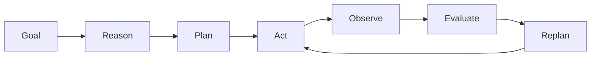
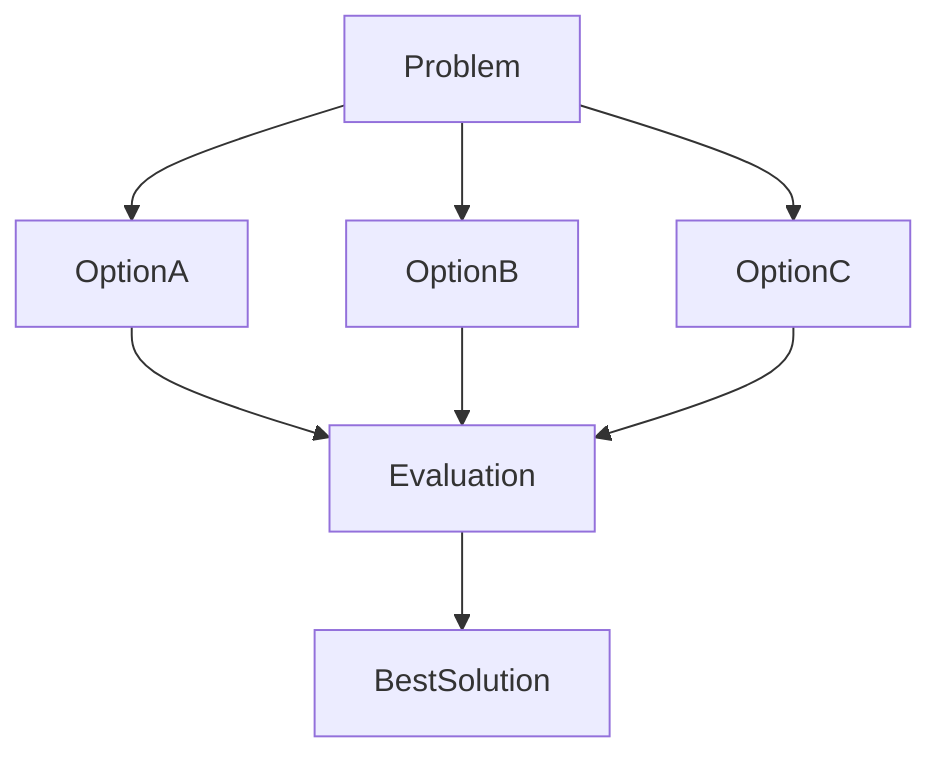
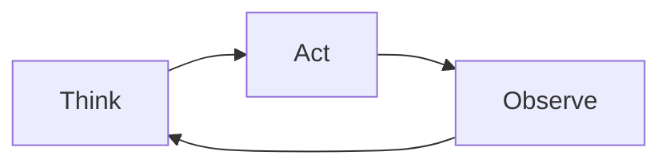
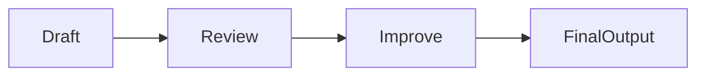
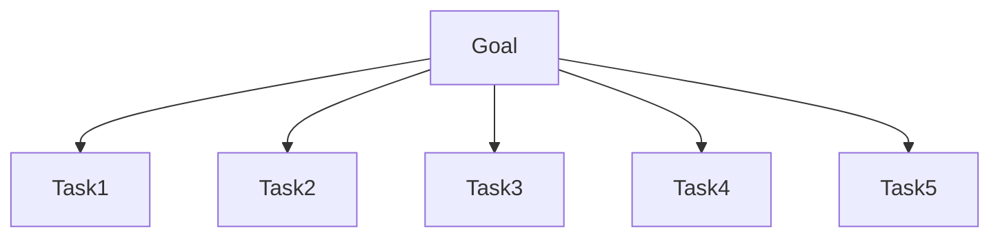
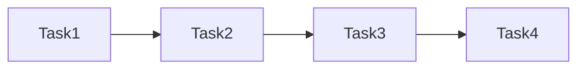
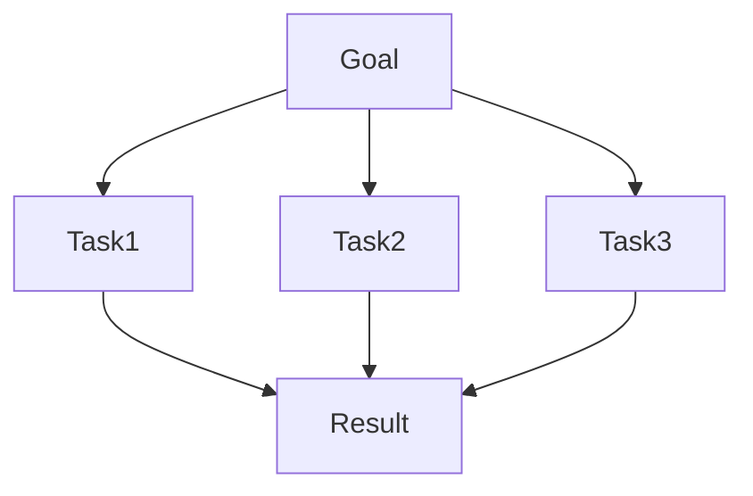
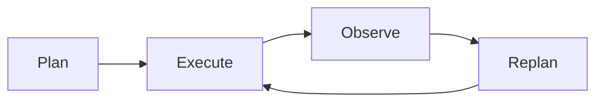

# Planning and Reasoning

## Overview

Reasoning and planning are the core capabilities that transform a Large Language Model (LLM) into an intelligent AI Agent.

While traditional chatbots generate responses based on user prompts, AI Agents must determine:

* What needs to be done
* How to achieve the objective
* Which tools to use
* What actions to take
* How to evaluate outcomes

Planning and reasoning enable agents to solve complex problems, execute multi-step workflows, adapt to changing conditions, and continuously improve their performance.

---

# Why Planning and Reasoning Matter

Consider the following user request:

> Create a competitive analysis report comparing the leading AI Agent frameworks.

A simple LLM might generate an answer immediately.

An AI Agent, however, will:

1. Identify relevant frameworks.
2. Gather information.
3. Analyze strengths and weaknesses.
4. Compare features.
5. Generate a structured report.
6. Validate the final output.

This structured approach significantly improves quality and reliability.

---

# Planning vs Reasoning

Although closely related, planning and reasoning serve different purposes.

| Capability | Purpose                                        |
| ---------- | ---------------------------------------------- |
| Reasoning  | Understand, analyze, and make decisions        |
| Planning   | Create a sequence of actions to achieve a goal |

---

## Reasoning Example

```text
Question:
Which AI Agent framework is most suitable for enterprise deployments?
```

The agent evaluates:

* Scalability
* Security
* Tool integration
* Governance features

before making a recommendation.

---

## Planning Example

```text
Goal:
Build a market research report.
```

The agent creates a workflow:

1. Research competitors
2. Collect data
3. Analyze findings
4. Generate report
5. Review output

---

# The Agent Thinking Cycle

Modern AI Agents operate through an iterative reasoning loop.



This cycle continues until the objective is achieved.

---

# Levels of Agent Reasoning

AI Agents can reason at different levels of sophistication.

## Level 1: Reactive Reasoning

Immediate response generation.

Example:

```text
User asks a question.
Agent answers.
```

Characteristics:

* Fast
* Simple
* No planning

---

## Level 2: Multi-Step Reasoning

Breaks problems into smaller components.

Example:

```text
Analyze customer feedback and identify key themes.
```

Steps:

1. Collect feedback
2. Categorize comments
3. Identify trends
4. Generate summary

---

## Level 3: Strategic Reasoning

Evaluates multiple paths before taking action.

Example:

```text
Recommend a cloud migration strategy.
```

The agent considers:

* Cost
* Risk
* Timeline
* Technical complexity

before making recommendations.

---

# Chain of Thought (CoT)

## Overview

Chain of Thought reasoning encourages an agent to think step-by-step before generating an answer.

Instead of jumping directly to a conclusion, the agent explains intermediate reasoning steps.

---

## Example

Question:

```text
A company has 10 developers and each developer fixes
3 defects per day. How many defects can be fixed in 5 days?
```

Reasoning:

1. 10 developers
2. Each fixes 3 defects per day
3. Total per day = 30 defects
4. Over 5 days = 150 defects

Answer:

```text
150 defects
```

---

## Benefits

* Improved accuracy
* Better transparency
* Easier debugging

---

# Tree of Thoughts (ToT)

## Overview

Tree of Thoughts extends Chain of Thought by exploring multiple reasoning paths simultaneously.

Instead of following one path, the agent evaluates several possible solutions.

---

## Architecture



---

## Example

Goal:

```text
Select an AI Agent framework.
```

The agent evaluates:

* LangGraph
* CrewAI
* AutoGen

and compares multiple alternatives before making a recommendation.

---

## Benefits

* Better decision quality
* Reduced reasoning errors
* Improved exploration

---

# ReAct (Reason + Act)

## Overview

ReAct combines reasoning with action execution.

The agent alternates between:

* Thinking
* Acting
* Observing

---

## ReAct Workflow



---

## Example

User Request:

```text
Find the latest AI Agent frameworks and summarize them.
```

Agent Process:

Think:

```text
Need current information.
```

Act:

```text
Perform web search.
```

Observe:

```text
Retrieved results.
```

Think:

```text
Analyze findings.
```

Act:

```text
Generate summary.
```

---

## Benefits

* Dynamic decision-making
* Real-time adaptation
* Better tool utilization

---

# Reflection

## Overview

Reflection enables an agent to review its own work and identify weaknesses.

Before delivering an answer, the agent asks:

* Is this correct?
* Is information missing?
* Can it be improved?

---

## Reflection Workflow



---

## Example

Initial Response:

```text
Generated market analysis report.
```

Reflection:

```text
Missing competitor comparison section.
```

Improved Response:

```text
Market analysis report with competitor comparison.
```

---

## Benefits

* Higher quality outputs
* Reduced hallucinations
* Better consistency

---

# Self-Correction

## Overview

Self-Correction allows agents to identify and fix mistakes automatically.

---

## Example

Agent calculates:

```text
10 × 5 = 40
```

Validation step detects the error.

Corrected answer:

```text
10 × 5 = 50
```

---

## Benefits

* Improved reliability
* Reduced error rates
* Better production readiness

---

# Goal Decomposition

Large objectives are divided into smaller tasks.

---

## Example

Goal:

```text
Build a market intelligence report.
```

Decomposed Tasks:

```text
Task 1:
Research competitors

Task 2:
Collect data

Task 3:
Analyze trends

Task 4:
Generate report

Task 5:
Review findings
```

---

## Goal Decomposition Diagram



---

# Planning Strategies

## Sequential Planning

Tasks are executed one after another.



Best for:

* Linear workflows
* Predictable processes

---

## Parallel Planning

Independent tasks execute simultaneously.



Best for:

* Research
* Data collection
* Distributed workflows

---

## Dynamic Planning

Plans change based on observations.



Best for:

* Autonomous agents
* Real-time environments

---

# Enterprise Planning Considerations

Organizations implementing AI Agents should consider:

## Governance

Questions include:

* Who approves actions?
* What actions require human review?

---

## Security

Agents should:

* Validate inputs
* Protect sensitive data
* Restrict tool access

---

## Cost Optimization

Planning affects:

* Token consumption
* API usage
* Infrastructure costs

---

## Explainability

Organizations need visibility into:

* Why decisions were made
* Which tools were used
* How conclusions were reached

---

# Planning Failures

Common planning issues include:

| Failure Type           | Example                    |
| ---------------------- | -------------------------- |
| Poor decomposition     | Missing critical tasks     |
| Incorrect assumptions  | Wrong data source selected |
| Tool misuse            | Using inappropriate tool   |
| Infinite loops         | Continuous replanning      |
| Hallucinated reasoning | Invalid conclusions        |

---

# Best Practices

## Define Clear Goals

Poorly defined objectives produce poor results.

---

## Use Structured Planning

Encourage:

* Task decomposition
* Milestone tracking
* Validation steps

---

## Implement Reflection

Require agents to review outputs before completion.

---

## Validate Results

Use:

* Tool verification
* Human review
* Automated checks

---

## Monitor Performance

Track:

* Task completion rates
* Accuracy
* Cost
* Latency

---

# Key Takeaways

Reasoning and planning are foundational capabilities of AI Agents.

Modern agents rely on advanced reasoning techniques such as:

* Chain of Thought (CoT)
* Tree of Thoughts (ToT)
* ReAct
* Reflection
* Self-Correction

Effective planning enables agents to:

* Decompose goals
* Execute complex workflows
* Adapt dynamically
* Improve decision quality

As AI Agents become increasingly autonomous, planning and reasoning will remain critical components for building reliable, secure, and scalable Agentic AI systems.

---

# Next Chapter

In the next chapter, **Memory Systems**, we will explore how AI Agents store, retrieve, and utilize information through short-term memory, long-term memory, vector databases, knowledge stores, and retrieval-augmented generation (RAG) architectures.
