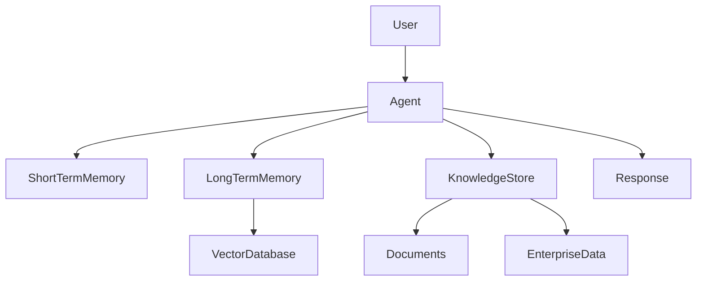
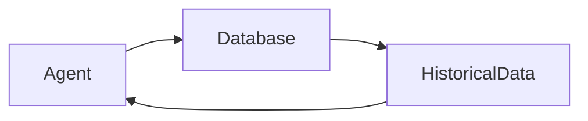
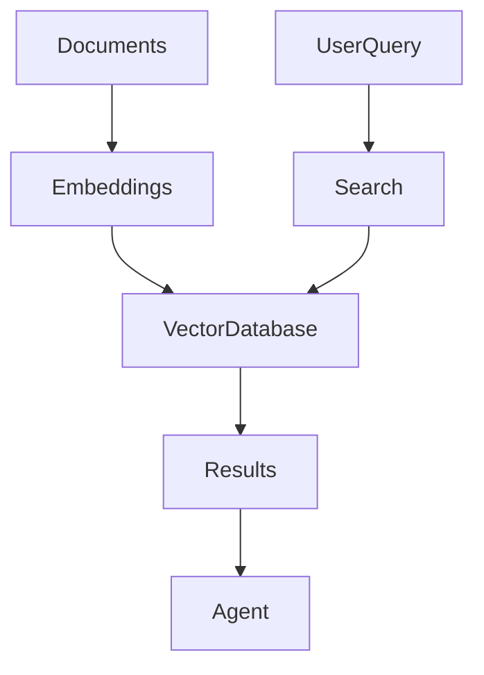
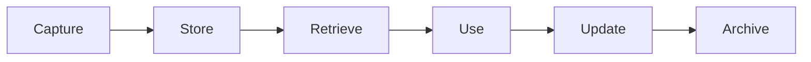
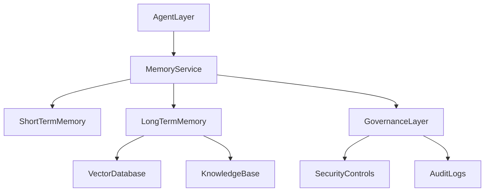

# Memory Systems

## Overview

Memory is one of the most important components of an AI Agent.

Without memory, an agent behaves like a stateless chatbot—each interaction starts from scratch, with no awareness of previous conversations, decisions, or experiences.

Memory enables AI Agents to:

* Retain context
* Learn from interactions
* Personalize responses
* Build long-term knowledge
* Improve decision-making
* Execute complex multi-step workflows

Just as human intelligence relies on memory to accumulate knowledge and experiences, AI Agents require memory systems to operate effectively in real-world environments.

---

# Why Memory Matters

Consider a customer support agent.

Without memory:

```text
User: My laptop isn't working.

Agent: Can you describe the issue?
```

Later:

```text
User: The screen is still black.

Agent: What device are you using?
```

The agent forgets previous context.

---

With memory:

```text
User: The screen is still black.

Agent:
You previously mentioned using a Dell Latitude 7440.
Let's continue troubleshooting from where we left off.
```

This creates a significantly better user experience.

---

# Memory in AI Agents

Memory allows agents to move beyond simple question-answer interactions.

Capabilities enabled by memory include:

* Context retention
* User personalization
* Experience reuse
* Knowledge accumulation
* Long-term task execution

---

## Memory Architecture



---

# Types of Memory

AI Agent memory systems are often modeled after human memory structures.

---

# 1. Short-Term Memory

## Definition

Short-Term Memory stores temporary information required for the current task or conversation.

It is often referred to as:

* Working Memory
* Session Memory
* Context Window

---

## Characteristics

| Feature  | Description         |
| -------- | ------------------- |
| Duration | Minutes to hours    |
| Scope    | Current interaction |
| Storage  | Temporary           |
| Usage    | Immediate reasoning |

---

## Examples

Stores:

* Current conversation
* Recent user inputs
* Active workflow state
* Temporary calculations

---

## Example

```text
User:
Create a project plan.

Agent:
What is the project scope?

User:
Cloud migration.
```

The agent remembers:

```text
Project = Cloud Migration
```

during the session.

---

## Benefits

* Context continuity
* Better conversations
* Improved task execution

---

## Limitations

* Limited capacity
* Lost when session ends
* Expensive in large context windows

---

# 2. Long-Term Memory

## Definition

Long-Term Memory stores information beyond a single session.

This enables agents to remember historical interactions and accumulated knowledge.

---

## Characteristics

| Feature  | Description       |
| -------- | ----------------- |
| Duration | Days to years     |
| Scope    | Multiple sessions |
| Storage  | Persistent        |
| Usage    | Knowledge recall  |

---

## Examples

Stores:

* User preferences
* Previous interactions
* Organizational knowledge
* Historical decisions

---

## Example

```text
User:
I prefer technical explanations.

Agent:
I'll provide detailed technical responses in future interactions.
```

The preference is retained across sessions.

---

## Benefits

* Personalization
* Knowledge accumulation
* Consistency

---

# 3. Episodic Memory

## Definition

Episodic Memory stores experiences and events.

It answers:

> What happened?

---

## Human Example

```text
I remember attending a conference last year.
```

---

## Agent Example

```text
The agent remembers resolving a similar support issue last month.
```

---

## Characteristics

Stores:

* Events
* Actions
* Outcomes
* Historical experiences

---

## Benefits

* Experience reuse
* Better decision-making
* Faster problem resolution

---

# 4. Semantic Memory

## Definition

Semantic Memory stores facts, concepts, and structured knowledge.

It answers:

> What do I know?

---

## Examples

Stores:

```text
PCI DSS is a payment card security standard.
```

```text
LangGraph is an AI Agent orchestration framework.
```

```text
Vector databases store embeddings for semantic retrieval.
```

---

## Benefits

* Knowledge retrieval
* Domain expertise
* Improved reasoning

---

# Memory Classification

| Memory Type | Purpose                |
| ----------- | ---------------------- |
| Short-Term  | Current context        |
| Long-Term   | Persistent information |
| Episodic    | Experiences            |
| Semantic    | Facts and knowledge    |

---

# Memory Storage Architectures

Modern AI Agents use various storage mechanisms.

---

# Context Window Memory

The simplest memory approach.

Stored within the LLM context window.


---

## Advantages

* Simple implementation
* Fast access

---

## Limitations

* Limited size
* Expensive scaling
* No persistence

---

# Database Memory

Stores structured information in databases.

Examples:

* PostgreSQL
* MySQL
* MongoDB

---

## Architecture



---

## Use Cases

* User profiles
* Customer data
* Transaction history

---

# Vector Memory

## Overview

Vector databases are the foundation of modern AI memory systems.

Instead of storing exact text, information is stored as numerical embeddings.

---

## Popular Vector Databases

| Platform      | Type          |
| ------------- | ------------- |
| Chroma        | Open Source   |
| Pinecone      | Managed       |
| Weaviate      | Open Source   |
| Milvus        | Open Source   |
| Qdrant        | Open Source   |
| Elasticsearch | Hybrid Search |

---

## Architecture



---

## Advantages

* Semantic search
* Similarity matching
* Scalable retrieval

---

# Retrieval-Augmented Generation (RAG)

## Overview

RAG combines memory retrieval with LLM reasoning.

Instead of relying only on model training data, the agent retrieves relevant information dynamically.

---

## RAG Workflow


---

## Benefits

* Reduced hallucinations
* Up-to-date information
* Enterprise knowledge integration

---

## Common RAG Use Cases

* Enterprise search
* Customer support
* Research assistants
* Knowledge management

---

# Memory Lifecycle

Memory should be managed throughout its lifecycle.



---

# Memory Challenges

---

## Context Explosion

As memory grows:

* Retrieval becomes harder
* Costs increase
* Latency increases

---

## Memory Drift

Stored information becomes outdated.

Example:

```text
Old company policy retained after policy changes.
```

---

## Hallucinated Memories

Agents may incorrectly store or recall information.

---

## Duplicate Information

Multiple versions of the same fact may exist.

---

## Security Risks

Memory may contain:

* Personal data
* Business secrets
* Confidential information

---

# Memory Governance

Organizations should establish controls for:

---

## Data Retention

Questions include:

* How long should memory be retained?
* When should data be deleted?

---

## Access Control

Determine:

* Who can access memory?
* Which agents have permissions?

---

## Compliance

Ensure alignment with:

* GDPR
* HIPAA
* PCI DSS
* ISO 27001

---

## Auditing

Track:

* Memory creation
* Memory updates
* Memory access

---

# Enterprise Memory Architecture



---

# Best Practices

## Store Only Valuable Information

Avoid saving unnecessary context.

---

## Use Retrieval Instead of Large Context Windows

RAG scales better than storing everything in prompts.

---

## Regularly Refresh Knowledge

Prevent outdated information.

---

## Implement Access Controls

Protect sensitive information.

---

## Monitor Memory Quality

Measure:

* Retrieval accuracy
* Relevance
* Freshness

---

# Future of Agent Memory

Emerging memory capabilities include:

* Self-organizing memory
* Memory compression
* Lifelong learning
* Cross-agent shared memory
* Knowledge graph integration
* Autonomous memory management

Future AI Agents will increasingly resemble human cognitive systems by combining multiple memory types and continuously learning from experience.

---

# Key Takeaways

Memory transforms AI Agents from stateless assistants into intelligent systems capable of learning, adapting, and retaining knowledge.

The four primary memory types are:

* Short-Term Memory
* Long-Term Memory
* Episodic Memory
* Semantic Memory

Modern memory architectures leverage:

* Databases
* Vector Stores
* Retrieval-Augmented Generation (RAG)
* Knowledge Bases

Effective memory management is critical for building scalable, personalized, and enterprise-ready AI Agent solutions.

---

# Next Chapter

In the next chapter, **Tool Usage and Function Calling**, we will explore how AI Agents interact with external systems, invoke APIs, use tools, execute actions, and extend their capabilities beyond the knowledge contained within a Large Language Model.
