# Tool Usage and Function Calling

## Overview

Large Language Models (LLMs) are powerful reasoning engines, but they are inherently limited by their training data and cannot directly interact with external systems.

AI Agents overcome these limitations through **Tool Usage** and **Function Calling**, enabling them to:

* Access real-time information
* Query databases
* Execute code
* Interact with APIs
* Retrieve enterprise knowledge
* Perform actions on behalf of users

Tool usage transforms AI Agents from passive assistants into active systems capable of completing real-world tasks.

---

# Why Tools Matter

Consider the following request:

> What is the current stock price of Apple?

A standalone LLM cannot reliably answer because stock prices change continuously.

An AI Agent can:

1. Identify the need for real-time data.
2. Invoke a market data API.
3. Retrieve the latest price.
4. Present the result.

This ability dramatically expands agent capabilities.

---

# From Language Models to Action-Oriented Agents

## Traditional LLM

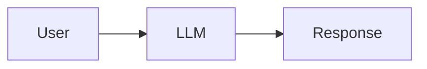

### Limitations

* No real-time information
* No system access
* No action execution
* No external integrations

---

## Tool-Augmented Agent

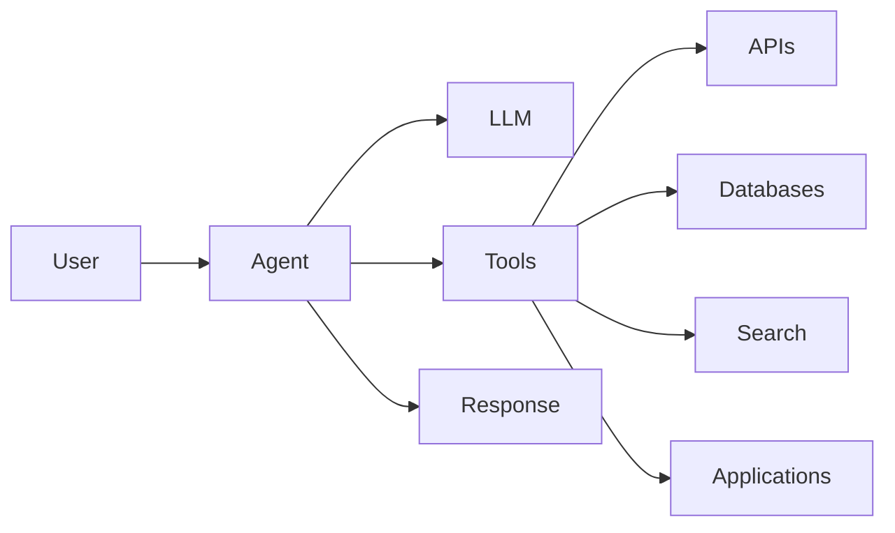

### Benefits

* Access to live data
* Enterprise integration
* Workflow automation
* Action execution

---

# What Is a Tool?

A tool is any external capability that an AI Agent can invoke to complete a task.

Examples include:

| Tool Type      | Example                 |
| -------------- | ----------------------- |
| Search         | Web search              |
| Database       | SQL query               |
| API            | Payment service         |
| File System    | Read/write files        |
| Calculator     | Mathematical operations |
| Code Execution | Python runtime          |
| Knowledge Base | Enterprise search       |
| Messaging      | Email, Slack, Teams     |
| CRM            | Salesforce              |
| ERP            | SAP                     |

---

# What Is Function Calling?

Function Calling is a mechanism that enables an LLM to request execution of predefined functions.

The model decides:

* Which function to use
* When to use it
* What parameters to provide

The application executes the function and returns results to the model.

---

# Function Calling Workflow

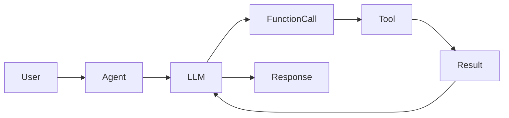

---

# Example: Weather Lookup

## User Request

```text
What is the weather in London today?
```

---

## Agent Reasoning

```text
Weather data requires real-time information.
A weather API should be used.
```

---

## Function Selection

```json
{
  "function": "get_weather",
  "location": "London"
}
```

---

## API Response

```json
{
  "temperature": "18°C",
  "condition": "Cloudy"
}
```

---

## Final Response

```text
The current temperature in London is 18°C with cloudy conditions.
```

---

# Tool Categories

Modern AI Agents typically use multiple categories of tools.

---

# 1. Information Retrieval Tools

Used to retrieve information.

Examples:

* Web search
* Enterprise search
* Knowledge bases
* Document repositories

---

## Architecture

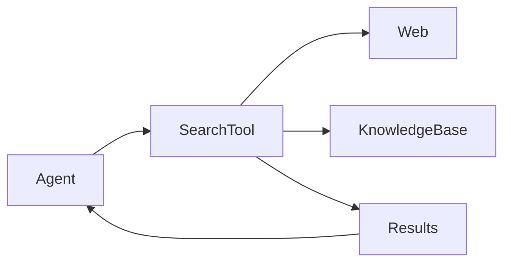

---

## Common Use Cases

* Research agents
* Customer support
* Knowledge assistants

---

# 2. Database Tools

Used to query structured data.

Examples:

* PostgreSQL
* MySQL
* MongoDB
* Snowflake

---

## Example

User asks:

```text
How many customers registered last month?
```

Agent executes:

```sql
SELECT COUNT(*)
FROM customers
WHERE registration_date >= '2025-01-01';
```

---

# 3. API Integration Tools

Enable interaction with external services.

Examples:

* Payment APIs
* CRM systems
* ERP platforms
* Cloud services

---

## Example

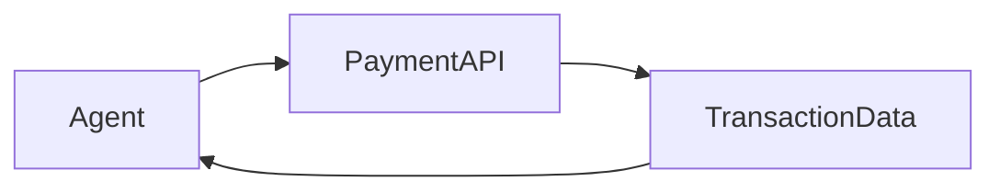

---

# 4. Code Execution Tools

Allow agents to execute code dynamically.

Supported languages may include:

* Python
* JavaScript
* SQL

---

## Example Use Cases

* Data analysis
* Visualization
* Calculations
* Automation

---

# 5. File Management Tools

Used to:

* Read files
* Create files
* Modify documents
* Process spreadsheets

---

## Examples

| File Type | Usage             |
| --------- | ----------------- |
| PDF       | Document analysis |
| CSV       | Data processing   |
| Excel     | Reporting         |
| JSON      | Configuration     |

---

# 6. Communication Tools

Enable agents to communicate with users and systems.

Examples:

* Email
* Slack
* Microsoft Teams
* SMS

---

## Example Workflow

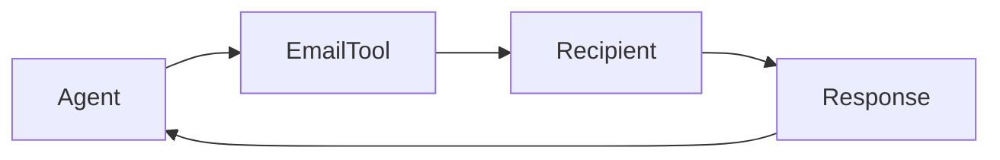

---

# Enterprise Tool Ecosystem

Most enterprise AI Agents interact with multiple systems simultaneously.

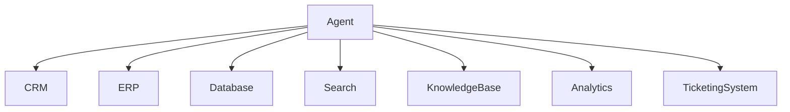

---

# Tool Selection Process

Agents should determine:

1. Whether a tool is needed.
2. Which tool is most appropriate.
3. What parameters are required.
4. How results should be validated.

---

## Decision Flow

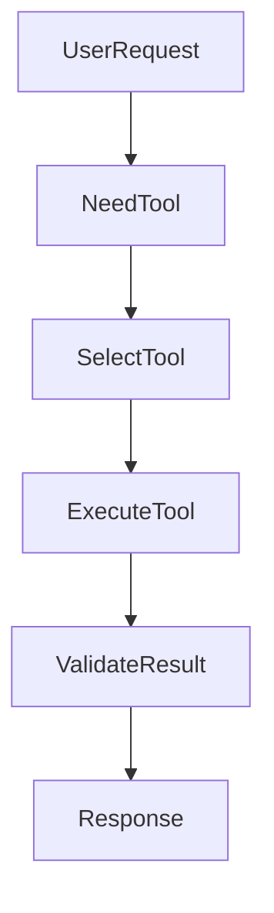

---

# Multi-Tool Workflows

Complex tasks often require multiple tools.

---

## Example: Market Research Agent

Goal:

```text
Create a market intelligence report.
```

Workflow:

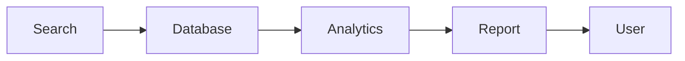

---

## Agent Activities

1. Search for competitors
2. Retrieve sales data
3. Analyze trends
4. Generate report

---

# Tool Chaining

Tool chaining occurs when the output of one tool becomes input to another.

---

## Example

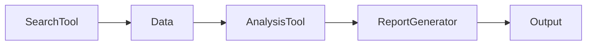

---

# Error Handling

Tool usage introduces new failure scenarios.

---

## Common Failures

| Failure Type       | Example             |
| ------------------ | ------------------- |
| API Failure        | Service unavailable |
| Timeout            | Slow response       |
| Invalid Parameters | Missing input       |
| Permission Error   | Access denied       |
| Data Quality Issue | Incorrect results   |

---

## Error Recovery Strategy

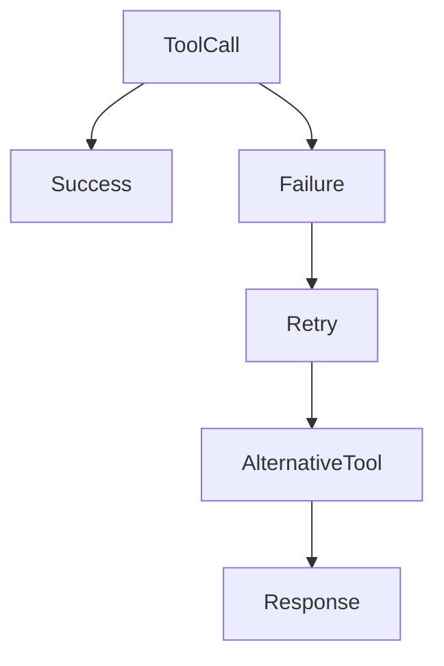

---

# Security Considerations

Tool usage significantly increases risk.

---

## Common Risks

### Prompt Injection

Attackers attempt to manipulate agent behavior.

### Unauthorized Actions

Agents execute actions without approval.

### Data Leakage

Sensitive information exposed through tools.

### Excessive Permissions

Tools granted more access than required.

---

# Security Best Practices

* Principle of least privilege
* Input validation
* Output sanitization
* API authentication
* Audit logging
* Human approval workflows

---

# Human-in-the-Loop Controls

Certain actions should require approval.

Examples:

* Financial transactions
* Customer refunds
* Production deployments
* Data deletion

---

## Approval Workflow

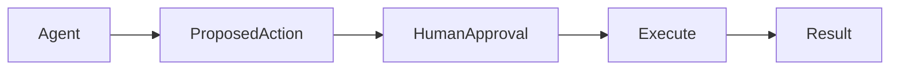

---

# Observability and Monitoring

Organizations should monitor:

* Tool usage frequency
* Success rates
* Failure rates
* Latency
* Cost
* Security events

---

## Key Metrics

| Metric            | Description            |
| ----------------- | ---------------------- |
| Tool Success Rate | Successful executions  |
| Latency           | Response time          |
| Cost per Request  | Operational cost       |
| Error Rate        | Failed calls           |
| Approval Rate     | Human-approved actions |

---

# Enterprise Function Calling Architecture

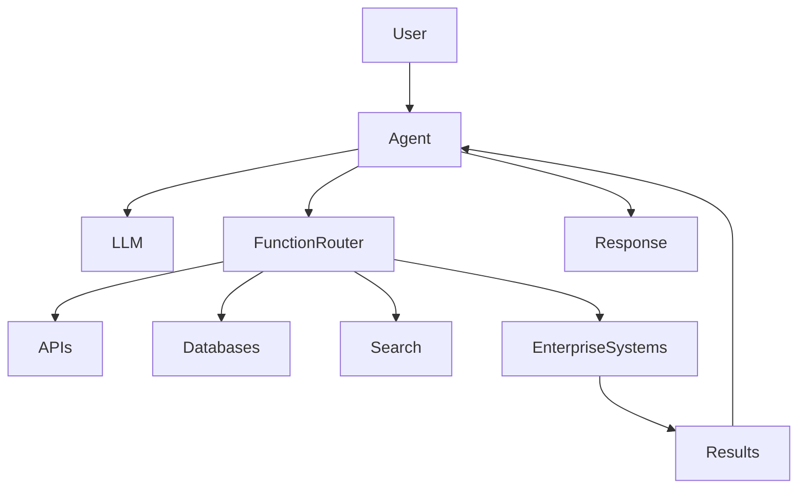

---

# Best Practices

## Use Clear Tool Definitions

Provide detailed descriptions and parameters.

---

## Limit Permissions

Grant only required access.

---

## Validate Tool Outputs

Never assume tool responses are correct.

---

## Monitor Tool Usage

Track performance and failures.

---

## Implement Human Oversight

Require approval for high-risk actions.

---

# Future of Tool Usage

Emerging trends include:

* Autonomous tool discovery
* Dynamic tool creation
* AI-generated APIs
* Multi-agent tool collaboration
* Self-healing workflows
* Tool marketplaces

Future AI Agents will increasingly function as intelligent orchestrators capable of coordinating hundreds of tools and services across enterprise ecosystems.

---

# Key Takeaways

Tool usage and function calling are foundational capabilities of modern AI Agents.

They enable agents to:

* Access external knowledge
* Perform actions
* Interact with systems
* Execute workflows
* Deliver real-world outcomes

Effective tool integration requires:

* Security controls
* Governance frameworks
* Monitoring capabilities
* Human oversight

Organizations that successfully combine reasoning, memory, planning, and tool usage will unlock the full potential of Agentic AI.

---

# Next Chapter

In the next chapter, **Multi-Agent Systems**, we will explore how multiple specialized agents collaborate, coordinate, and communicate to solve complex business and engineering problems at scale.
