# Multi-Agent Systems

## Overview

As AI systems become more sophisticated, a single agent is often insufficient to solve complex enterprise problems.

Modern organizations require AI systems that can:

* Perform multiple tasks simultaneously
* Leverage specialized expertise
* Coordinate across business functions
* Scale efficiently
* Handle complex workflows

This has led to the emergence of **Multi-Agent Systems (MAS)**, where multiple AI agents collaborate to achieve shared objectives.

Instead of relying on one general-purpose agent, Multi-Agent Systems distribute work among specialized agents, similar to how teams of humans collaborate in organizations.

---

# What Is a Multi-Agent System?

A Multi-Agent System (MAS) is a collection of autonomous AI agents that interact, coordinate, and collaborate to solve problems or accomplish goals.

Each agent may possess:

* Specialized skills
* Independent reasoning capabilities
* Dedicated tools
* Unique responsibilities
* Individual memory systems

Together, they form a distributed intelligence architecture.

---

# Single Agent vs Multi-Agent

| Characteristic         | Single Agent            | Multi-Agent System |
| ---------------------- | ----------------------- | ------------------ |
| Complexity Handling    | Medium                  | Very High          |
| Scalability            | Limited                 | High               |
| Specialization         | General Purpose         | Specialized        |
| Parallel Processing    | Limited                 | Extensive          |
| Reliability            | Single Point of Failure | Distributed        |
| Enterprise Suitability | Medium                  | High               |

---

# Why Multi-Agent Systems?

As tasks become more complex, dividing responsibilities improves performance.

Consider a market research project.

A single agent would need to:

* Gather data
* Analyze competitors
* Create visualizations
* Write reports

A Multi-Agent System can distribute these tasks across specialized agents.

---

## Human Team Analogy

```text
Project Manager
      |
      +-- Research Specialist
      +-- Data Analyst
      +-- Report Writer
      +-- Reviewer
```

Multi-Agent Systems operate similarly.

---

# Core Characteristics

## Autonomy

Each agent independently performs assigned tasks.

---

## Collaboration

Agents work together toward common goals.

---

## Communication

Agents exchange information and decisions.

---

## Specialization

Each agent focuses on a specific domain or capability.

---

## Coordination

Activities are orchestrated to ensure successful outcomes.

---

# Multi-Agent Architecture

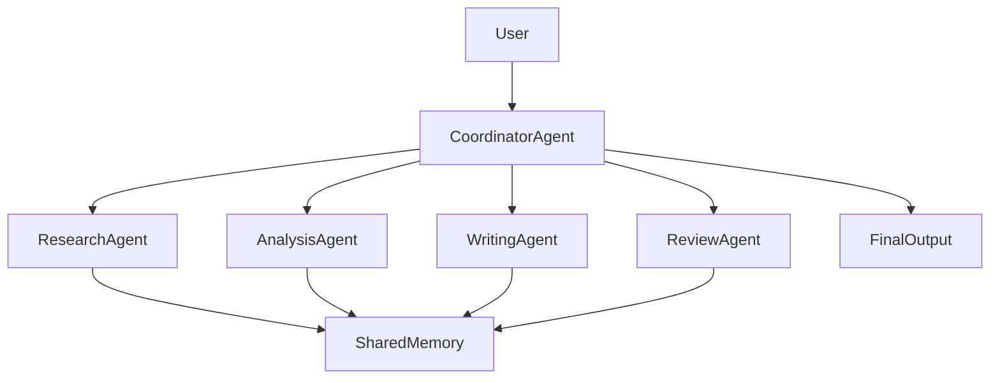

---

# Roles in Multi-Agent Systems

## Coordinator Agent

Acts as the orchestrator.

Responsibilities:

* Task allocation
* Workflow management
* Conflict resolution
* Progress monitoring

---

## Specialist Agents

Perform domain-specific tasks.

Examples:

* Research Agent
* Coding Agent
* Testing Agent
* Analytics Agent
* Documentation Agent

---

## Reviewer Agent

Validates outputs.

Responsibilities:

* Quality checks
* Fact verification
* Compliance validation

---

# Multi-Agent Workflow

Consider the goal:

> Create a competitive analysis report for AI Agent platforms.

---

## Step 1: Goal Assignment

Coordinator receives objective.

---

## Step 2: Task Decomposition

Tasks distributed:

| Agent          | Responsibility      |
| -------------- | ------------------- |
| Research Agent | Gather information  |
| Analysis Agent | Analyze competitors |
| Writing Agent  | Generate report     |
| Review Agent   | Validate report     |

---

## Step 3: Parallel Execution

Agents work simultaneously.

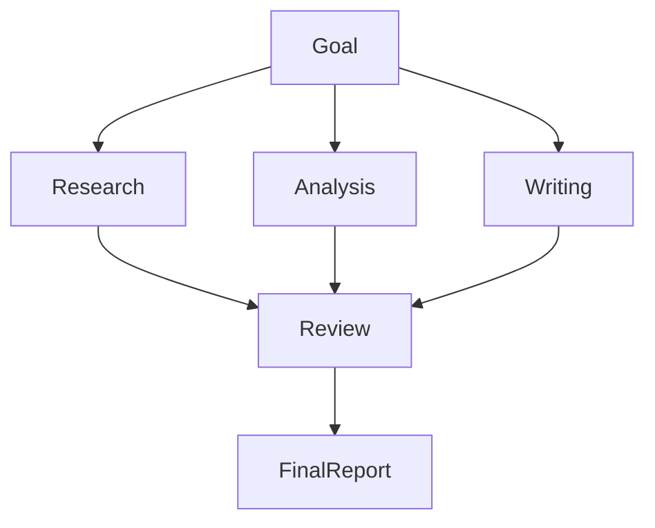

---

## Step 4: Consolidation

Results combined into a final output.

---

# Communication Models

Communication is fundamental in Multi-Agent Systems.

---

# Direct Communication

Agents communicate directly.

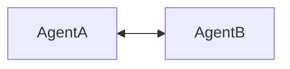

### Advantages

* Simple
* Fast

### Challenges

* Scalability issues

---

# Shared Memory Communication

Agents communicate through a shared knowledge repository.

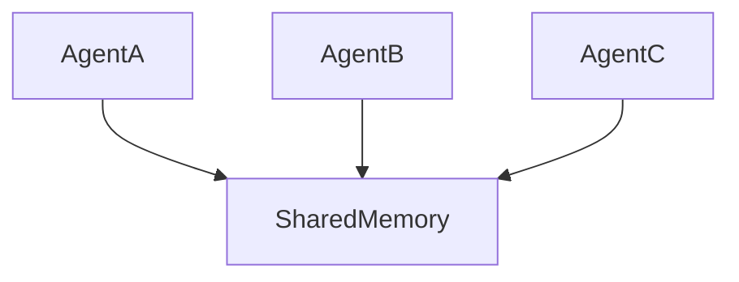

### Advantages

* Better scalability
* Easier coordination

---

# Event-Driven Communication

Agents communicate through events.

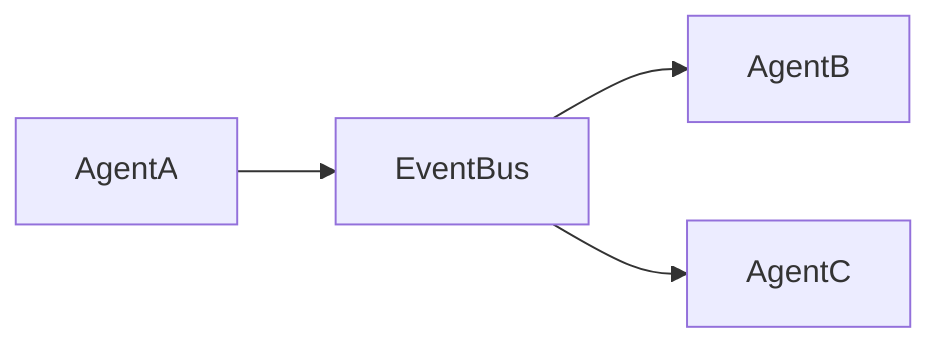

### Advantages

* Decoupled architecture
* High scalability

---

# Multi-Agent Coordination Patterns

---

# Pattern 1: Manager-Worker

A manager agent assigns tasks to worker agents.

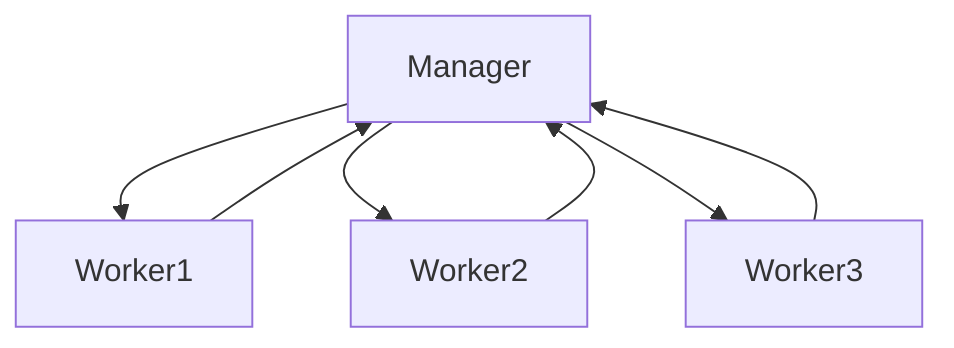

### Use Cases

* Research automation
* Data processing

---

# Pattern 2: Hierarchical Coordination

Agents organized into layers.

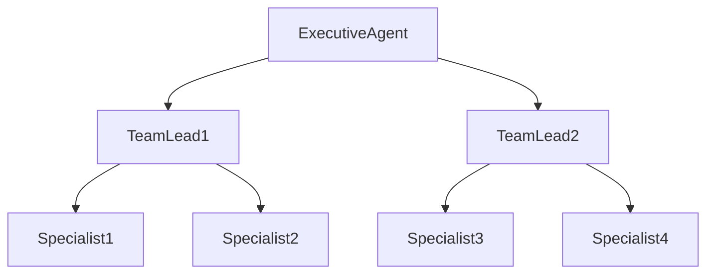

### Use Cases

* Enterprise workflows
* Digital workforce systems

---

# Pattern 3: Peer-to-Peer

Agents collaborate as equals.

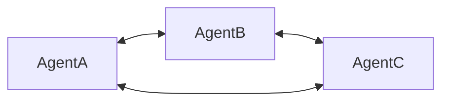

### Use Cases

* Distributed intelligence systems

---

# Pattern 4: Blackboard Architecture

Agents contribute knowledge to a shared workspace.

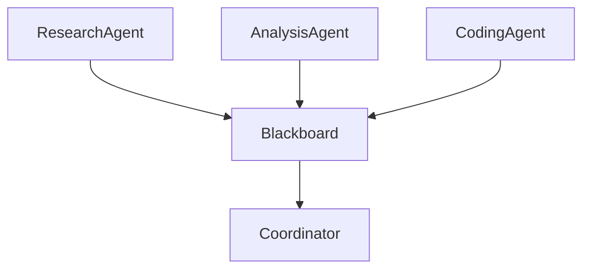

### Use Cases

* Collaborative problem solving
* Research platforms

---

# Multi-Agent Memory

Multi-Agent Systems often require shared memory.

---

## Individual Memory

Each agent maintains:

* Context
* Knowledge
* Task history

---

## Shared Memory

Stores:

* Project information
* Shared knowledge
* Intermediate outputs

---

## Architecture

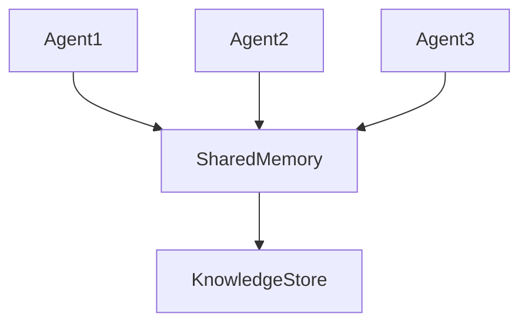

---

# Enterprise Use Cases

---

# Research and Intelligence

Agents:

* Search information
* Analyze findings
* Create reports

---

# Software Engineering

Agents:

* Generate code
* Review code
* Execute tests
* Create documentation

---

# Customer Support

Agents:

* Classify tickets
* Retrieve knowledge
* Draft responses
* Escalate issues

---

# Financial Services

Agents:

* Monitor transactions
* Detect fraud
* Perform compliance checks
* Generate reports

---

# Healthcare

Agents:

* Review patient records
* Retrieve medical knowledge
* Assist clinicians
* Generate summaries

---

# AI Agent Team Example

## Software Development Team

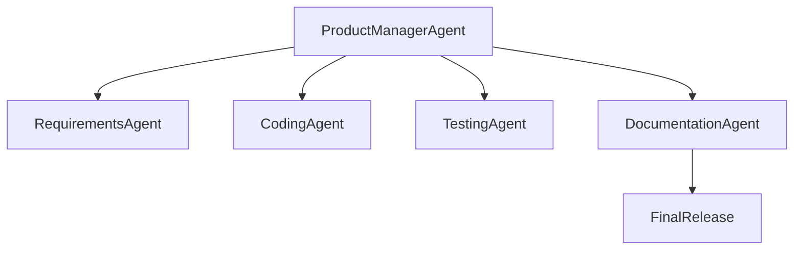

---

## Responsibilities

### Requirements Agent

* Analyze requirements
* Create user stories

### Coding Agent

* Generate code
* Refactor code

### Testing Agent

* Generate tests
* Execute validation

### Documentation Agent

* Create technical documentation

---

# Challenges of Multi-Agent Systems

---

## Coordination Complexity

More agents create more interactions.

---

## Communication Overhead

Agents must exchange information effectively.

---

## Cost

Multiple agents consume:

* Tokens
* Compute resources
* Infrastructure

---

## Conflicting Decisions

Agents may produce contradictory recommendations.

---

## Governance

Organizations need controls for:

* Access permissions
* Auditing
* Compliance

---

# Security Considerations

## Agent Isolation

Prevent unauthorized access between agents.

---

## Data Protection

Secure shared memory and communications.

---

## Access Control

Define permissions for each agent.

---

## Audit Logging

Track:

* Actions
* Decisions
* Tool usage

---

# Evaluation Metrics

Organizations should monitor:

| Metric                  | Description                    |
| ----------------------- | ------------------------------ |
| Task Completion Rate    | Percentage of successful tasks |
| Agent Accuracy          | Correctness of outputs         |
| Coordination Efficiency | Collaboration effectiveness    |
| Response Time           | Time to complete workflows     |
| Cost per Workflow       | Operational efficiency         |

---

# Best Practices

## Clearly Define Roles

Avoid overlapping responsibilities.

---

## Use Specialized Agents

Focus agents on specific domains.

---

## Implement Shared Memory

Enable collaboration and knowledge reuse.

---

## Establish Governance Controls

Manage security and compliance.

---

## Monitor Agent Performance

Track quality, costs, and reliability.

---

# Future of Multi-Agent Systems

The next generation of AI systems will increasingly adopt Multi-Agent architectures.

Emerging trends include:

* Autonomous agent teams
* Dynamic agent creation
* Agent marketplaces
* Cross-organizational collaboration
* Self-organizing agent networks
* Enterprise digital workforces

Future enterprises may operate with hundreds or thousands of specialized AI agents collaborating across business functions.

---

# Key Takeaways

Multi-Agent Systems extend the capabilities of individual AI agents by enabling collaboration, specialization, and distributed problem solving.

Key benefits include:

* Scalability
* Specialization
* Parallel execution
* Improved quality
* Enterprise readiness

Successful implementations require:

* Effective coordination
* Robust communication
* Shared memory
* Governance controls
* Performance monitoring

Multi-Agent Systems represent a foundational architecture for the future of Agentic AI.

---

# Next Chapter

In the next chapter, **Agent Evaluation Frameworks**, we will explore how to measure, benchmark, validate, and continuously improve AI Agent performance using evaluation metrics, scorecards, testing methodologies, and governance frameworks.
