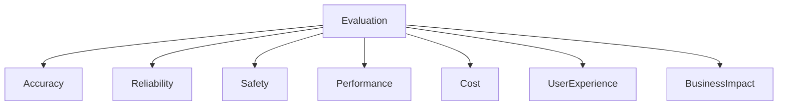
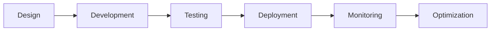
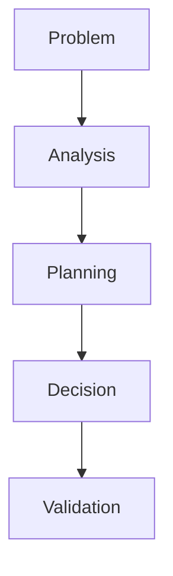
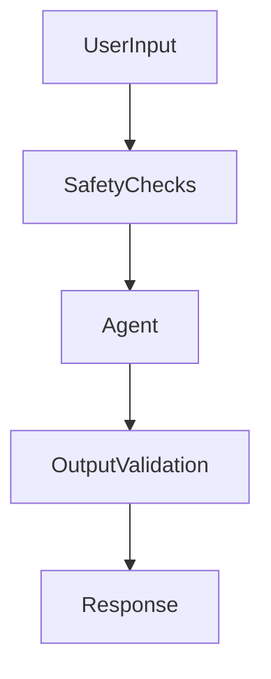
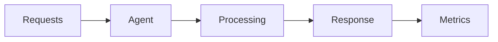
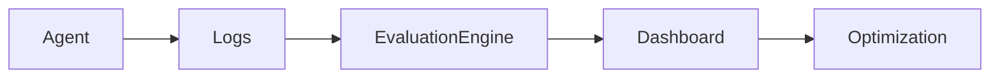

# Agent Evaluation Frameworks

## Overview

Building an AI Agent is only the first step. The real challenge is ensuring that the agent consistently delivers accurate, reliable, safe, and valuable outcomes in production environments.

Unlike traditional software systems, AI Agents exhibit probabilistic behavior. The same input may produce different outputs depending on context, reasoning paths, memory, tool usage, and model configurations.

Therefore, organizations need structured evaluation frameworks to measure:

* Accuracy
* Reliability
* Safety
* Performance
* Cost efficiency
* User satisfaction
* Business impact

This chapter introduces comprehensive evaluation methodologies for AI Agents and provides practical guidance for establishing enterprise-grade evaluation programs.

---

# Why Agent Evaluation Matters

Consider a customer support AI Agent.

A traditional software test may verify:

```text
Input → Expected Output
```

However, AI Agents must also be evaluated for:

* Correct reasoning
* Appropriate tool selection
* Safe decision-making
* Compliance adherence
* Quality of generated responses

Without evaluation frameworks, organizations risk:

* Hallucinations
* Incorrect actions
* Security vulnerabilities
* Compliance violations
* Poor user experiences

---

# Evaluation Dimensions

AI Agent evaluation extends beyond accuracy.

## Enterprise Evaluation Model



---

## Core Evaluation Categories

| Category        | Purpose                             |
| --------------- | ----------------------------------- |
| Accuracy        | Correctness of outputs              |
| Reliability     | Consistency across runs             |
| Safety          | Prevention of harmful behavior      |
| Performance     | Speed and scalability               |
| Cost Efficiency | Resource optimization               |
| User Experience | Satisfaction and usability          |
| Business Impact | Value delivered to the organization |

---

# Evaluation Lifecycle

Evaluation should occur throughout the agent lifecycle.



---

## Stages

### Design Phase

Evaluate:

* Architecture choices
* Agent responsibilities
* Tool strategy

### Development Phase

Evaluate:

* Prompt quality
* Reasoning approaches
* Tool integrations

### Testing Phase

Validate:

* Functional behavior
* Edge cases
* Security controls

### Production Phase

Monitor:

* Performance
* User feedback
* Business outcomes

---

# Functional Evaluation

## Purpose

Measures whether the agent successfully completes assigned tasks.

---

## Example

User Request:

```text
Generate a project risk assessment report.
```

Evaluation Criteria:

* Report generated
* Risks identified
* Mitigation strategies included

---

## Functional Metrics

| Metric                   | Description                         |
| ------------------------ | ----------------------------------- |
| Task Completion Rate     | Percentage of completed tasks       |
| Success Rate             | Percentage of successful executions |
| Goal Achievement Rate    | Achievement of intended outcomes    |
| Workflow Completion Rate | Multi-step workflow success         |

---

# Reasoning Evaluation

## Purpose

Measures the quality of agent thinking and decision-making.

---

## Evaluation Areas

* Logical consistency
* Problem decomposition
* Decision quality
* Planning effectiveness

---

## Example

Problem:

```text
Recommend a cloud migration strategy.
```

Evaluation:

* Were risks considered?
* Were alternatives evaluated?
* Was reasoning coherent?

---

## Reasoning Assessment Framework



---

## Reasoning Metrics

| Metric              | Description              |
| ------------------- | ------------------------ |
| Logical Consistency | Soundness of reasoning   |
| Planning Quality    | Effectiveness of plans   |
| Decision Accuracy   | Correctness of decisions |
| Reflection Score    | Quality of self-review   |

---

# Tool Usage Evaluation

## Purpose

Measure how effectively the agent uses external tools.

---

## Questions

* Was the correct tool selected?
* Were parameters accurate?
* Was tool output interpreted correctly?

---

## Example

User Request:

```text
Find current exchange rates.
```

Evaluation:

* Weather API selected ❌
* Currency API selected ✅

---

## Tool Metrics

| Metric                  | Description                   |
| ----------------------- | ----------------------------- |
| Tool Selection Accuracy | Correct tool chosen           |
| Tool Success Rate       | Successful executions         |
| Tool Failure Rate       | Failed calls                  |
| Tool Efficiency         | Number of tool calls required |

---

# Memory Evaluation

## Purpose

Measure how effectively the agent stores and retrieves information.

---

## Areas

* Context retention
* Memory recall
* Personalization
* Knowledge retrieval

---

## Example

Conversation:

```text
User:
I prefer technical explanations.
```

Later:

```text
Agent provides technical response.
```

Evaluation:

* Preference remembered? ✅
* Preference forgotten? ❌

---

## Memory Metrics

| Metric                 | Description                          |
| ---------------------- | ------------------------------------ |
| Recall Accuracy        | Correct retrieval rate               |
| Memory Relevance       | Usefulness of retrieved information  |
| Personalization Score  | Adaptation to user preferences       |
| Context Retention Rate | Preservation of conversation context |

---

# Safety Evaluation

## Purpose

Ensure agents behave responsibly and securely.

---

## Safety Categories

### Harmful Content

Prevent:

* Violence
* Hate speech
* Harassment

---

### Security Risks

Prevent:

* Prompt injection
* Data leakage
* Unauthorized actions

---

### Compliance Risks

Prevent:

* Regulatory violations
* Privacy breaches

---

## Safety Architecture



---

## Safety Metrics

| Metric                      | Description                  |
| --------------------------- | ---------------------------- |
| Harmful Response Rate       | Unsafe outputs generated     |
| Prompt Injection Resistance | Ability to withstand attacks |
| Compliance Violation Rate   | Regulatory failures          |
| Security Incident Count     | Number of security issues    |

---

# Reliability Evaluation

## Purpose

Measure consistency and stability.

---

## Example

Prompt:

```text
Generate a software testing strategy.
```

Run 1:

```text
High-quality response
```

Run 2:

```text
Low-quality response
```

Reliability is reduced.

---

## Reliability Metrics

| Metric            | Description             |
| ----------------- | ----------------------- |
| Consistency Score | Similarity across runs  |
| Failure Rate      | Execution failures      |
| Availability      | Agent uptime            |
| Recovery Rate     | Recovery after failures |

---

# Performance Evaluation

## Purpose

Measure responsiveness and scalability.

---

## Metrics

| Metric        | Description                      |
| ------------- | -------------------------------- |
| Response Time | Time to answer                   |
| Throughput    | Requests processed               |
| Latency       | Delay before response            |
| Scalability   | Ability to handle increased load |

---

## Performance Architecture



---

# Cost Evaluation

## Why It Matters

AI Agents consume:

* Tokens
* API calls
* Infrastructure resources

Cost monitoring is essential.

---

## Cost Metrics

| Metric              | Description                  |
| ------------------- | ---------------------------- |
| Cost per Request    | Average request cost         |
| Cost per Workflow   | End-to-end workflow cost     |
| Token Consumption   | LLM usage                    |
| Infrastructure Cost | Compute and storage expenses |

---

# User Experience Evaluation

## Purpose

Measure user satisfaction.

---

## Factors

* Helpfulness
* Clarity
* Trustworthiness
* Ease of use

---

## User Metrics

| Metric               | Description                  |
| -------------------- | ---------------------------- |
| Satisfaction Score   | User feedback rating         |
| Resolution Rate      | Problems solved              |
| User Retention       | Continued usage              |
| Recommendation Score | Likelihood of recommendation |

---

# Business Impact Evaluation

## Purpose

Measure organizational value.

---

## Business Questions

* Is productivity improving?
* Are costs decreasing?
* Is customer satisfaction increasing?

---

## Business Metrics

| Metric            | Description                  |
| ----------------- | ---------------------------- |
| Productivity Gain | Efficiency improvement       |
| Cost Savings      | Reduced operational expenses |
| Revenue Impact    | Business growth contribution |
| ROI               | Return on investment         |

---

# Agent Evaluation Scorecard

## Example Enterprise Scorecard

| Category        | Weight | Score |
| --------------- | ------ | ----- |
| Accuracy        | 25%    | 90    |
| Reliability     | 15%    | 85    |
| Safety          | 20%    | 95    |
| Performance     | 10%    | 88    |
| Tool Usage      | 10%    | 91    |
| Memory          | 10%    | 87    |
| User Experience | 10%    | 89    |

### Overall Score

```text
Weighted Agent Score = 89.7/100
```

---

# Human Evaluation

Automated metrics alone are insufficient.

Human reviewers should assess:

* Quality
* Relevance
* Creativity
* Business value

---

## Human Review Criteria

| Criterion       | Description         |
| --------------- | ------------------- |
| Accuracy        | Correct information |
| Completeness    | Full coverage       |
| Clarity         | Easy to understand  |
| Relevance       | Meets objectives    |
| Professionalism | Appropriate tone    |

---

# Automated Evaluation

Automated systems can evaluate:

* Response quality
* Tool selection
* Latency
* Safety compliance

Benefits:

* Scalability
* Consistency
* Continuous monitoring

---

# Continuous Evaluation Pipeline



---

# Enterprise Best Practices

## Establish Evaluation Standards

Create organization-wide benchmarks.

---

## Evaluate Before Production

Validate:

* Accuracy
* Safety
* Reliability

---

## Monitor Continuously

Evaluation should not stop after deployment.

---

## Combine Human and Automated Reviews

Both approaches are necessary.

---

## Track Business Outcomes

Measure actual organizational impact.

---

# Future of Agent Evaluation

Emerging trends include:

* AI-powered evaluation agents
* Autonomous benchmarking systems
* Continuous red teaming
* Self-evaluating agents
* Multi-agent assessment frameworks
* Real-time governance monitoring

Future AI ecosystems will increasingly rely on automated evaluation systems to ensure trust, safety, and performance at scale.

---

# Key Takeaways

Evaluation is a foundational capability for enterprise AI Agent deployments.

Organizations should assess:

* Accuracy
* Reasoning
* Tool usage
* Memory effectiveness
* Safety
* Reliability
* Performance
* Cost efficiency
* User satisfaction
* Business impact

A comprehensive evaluation framework enables organizations to build trustworthy, scalable, and production-ready AI Agents.

---

# Next Chapter

In the next chapter, **Agent Security and Safety**, we will explore threats, vulnerabilities, governance controls, risk mitigation strategies, and security architectures required for deploying AI Agents in enterprise environments.
