# Production AI Agents

## Overview

Building an AI Agent prototype is relatively easy. Deploying and operating AI Agents reliably at enterprise scale is significantly more challenging.

Production AI Agents must be:

* Reliable
* Scalable
* Secure
* Observable
* Cost-efficient
* Governed
* Continuously evaluated

Organizations often discover that moving from a proof-of-concept to a production-ready AI Agent requires new architecture patterns, operational processes, monitoring frameworks, and governance controls.

This chapter explores the principles, architectures, and best practices required to successfully deploy AI Agents into production environments.

---

# From Prototype to Production

Most AI Agent journeys follow a similar progression.

---

## Prototype Stage

Focus:

* Experimentation
* Rapid development
* Prompt engineering
* Basic workflows

Characteristics:

* Limited users
* Minimal governance
* Low operational requirements

---

## Pilot Stage

Focus:

* Controlled deployment
* User validation
* Initial monitoring

Characteristics:

* Small user base
* Limited automation
* Early governance controls

---

## Production Stage

Focus:

* Reliability
* Security
* Scalability
* Compliance

Characteristics:

* Business-critical workloads
* Enterprise integrations
* Operational support

---

# Production Architecture

A production AI Agent consists of multiple interconnected components.

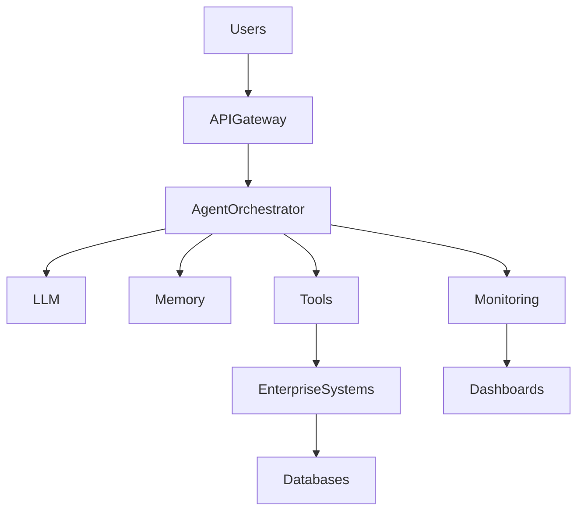

---

## Key Components

| Component          | Purpose                       |
| ------------------ | ----------------------------- |
| API Gateway        | Entry point for requests      |
| Agent Orchestrator | Coordinates workflows         |
| LLM                | Reasoning engine              |
| Memory Layer       | Context and knowledge storage |
| Tool Layer         | External integrations         |
| Monitoring Layer   | Observability and metrics     |
| Enterprise Systems | Business applications         |

---

# Production Design Principles

Successful production systems follow several key principles.

---

## Reliability

Agents should consistently deliver expected outcomes.

Requirements:

* Fault tolerance
* Error handling
* Recovery mechanisms

---

## Scalability

Agents should support increasing workloads.

Requirements:

* Horizontal scaling
* Load balancing
* Distributed execution

---

## Security

Agents must protect:

* Data
* Systems
* Users

Requirements:

* Authentication
* Authorization
* Encryption

---

## Observability

Organizations must understand:

* Agent behavior
* Decisions
* Failures

Requirements:

* Logging
* Monitoring
* Tracing

---

# Agent Deployment Models

Several deployment models are commonly used.

---

# Centralized Deployment

All agents run within a shared platform.

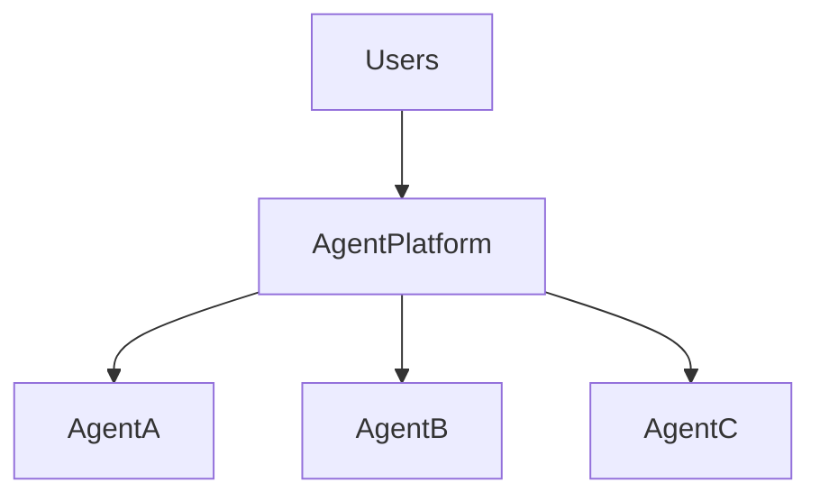

### Benefits

* Simplified management
* Shared infrastructure

### Challenges

* Potential bottlenecks
* Shared resource contention

---

# Distributed Deployment

Agents operate independently.

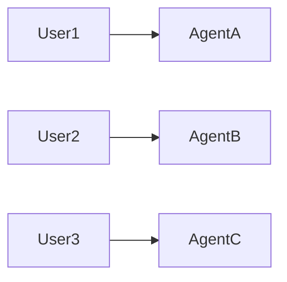

### Benefits

* High scalability
* Fault isolation

### Challenges

* Increased operational complexity

---

# Multi-Agent Enterprise Platform

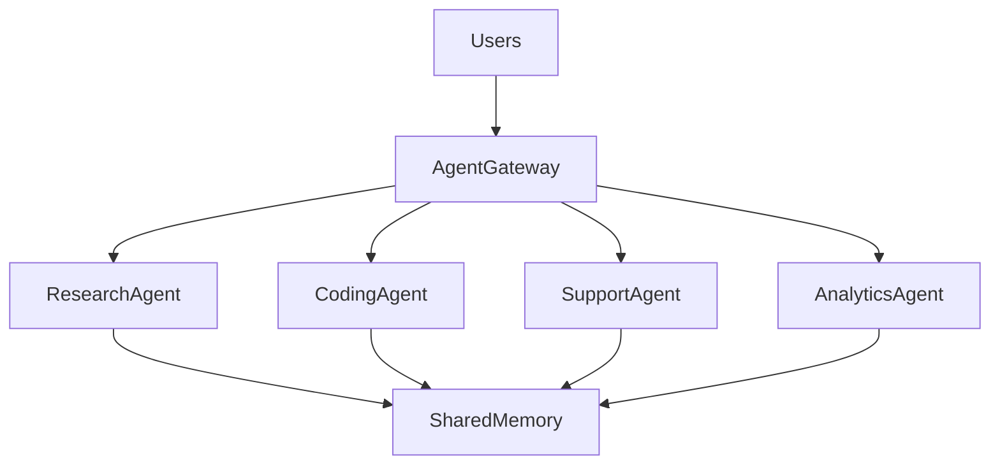

---

# Agent Orchestration

Production systems require orchestration layers.

Responsibilities include:

* Workflow execution
* Agent coordination
* Tool routing
* Memory management
* Error handling

---

## Orchestration Workflow

---

# Memory in Production

Production AI Agents require persistent memory systems.

---

## Memory Types

| Memory Type      | Purpose                   |
| ---------------- | ------------------------- |
| Session Memory   | Current interaction       |
| Long-Term Memory | Persistent information    |
| Knowledge Memory | Enterprise knowledge      |
| Shared Memory    | Multi-agent collaboration |

---

## Production Memory Architecture

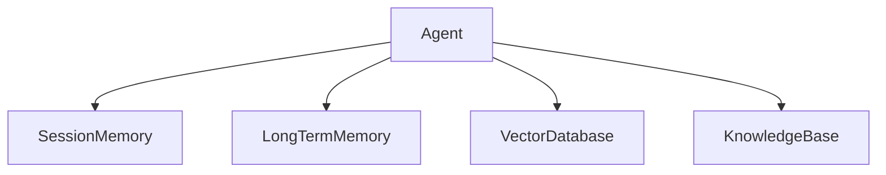

---

# Tool Integration

Production Agents frequently interact with enterprise systems.

Examples:

* CRM platforms
* ERP systems
* Ticketing platforms
* Data warehouses
* Payment systems

---

## Tool Integration Architecture

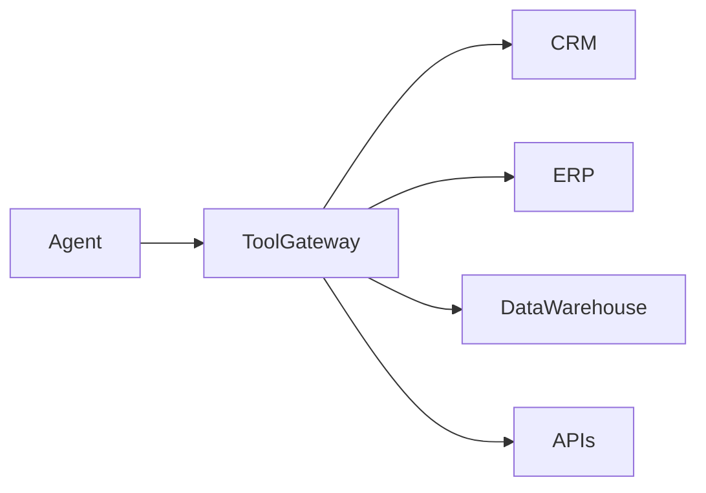

---

# Human-in-the-Loop Operations

Not all decisions should be fully autonomous.

Organizations often implement approval workflows.

---

## Examples

Require approval for:

* Financial transactions
* Data deletion
* Security changes
* Regulatory decisions

---

## Approval Architecture

---

# Observability

Production AI systems require deep visibility.

---

## Observability Pillars

### Logs

Record:

* User interactions
* Agent decisions
* Tool usage

---

### Metrics

Measure:

* Accuracy
* Latency
* Cost

---

### Traces

Track:

* End-to-end execution
* Workflow dependencies

---

## Observability Framework

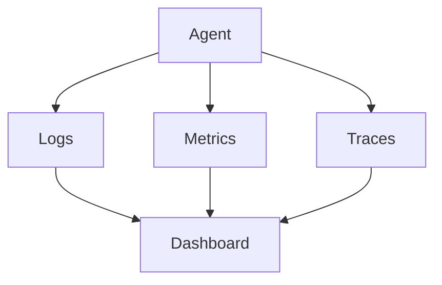

---

# Key Production Metrics

## Operational Metrics

| Metric        | Description              |
| ------------- | ------------------------ |
| Uptime        | Availability             |
| Response Time | Request processing speed |
| Throughput    | Requests handled         |
| Error Rate    | Failed requests          |

---

## AI Metrics

| Metric                 | Description                     |
| ---------------------- | ------------------------------- |
| Accuracy               | Correct outputs                 |
| Hallucination Rate     | Incorrect generated information |
| Tool Success Rate      | Successful tool executions      |
| Memory Recall Accuracy | Retrieval effectiveness         |

---

## Business Metrics

| Metric                   | Description              |
| ------------------------ | ------------------------ |
| User Satisfaction        | Experience quality       |
| Productivity Improvement | Efficiency gains         |
| Cost Savings             | Operational benefits     |
| ROI                      | Business value generated |

---

# Reliability Engineering

AI Agents must be resilient.

---

## Failure Types

| Failure                | Example              |
| ---------------------- | -------------------- |
| LLM Failure            | Provider unavailable |
| Tool Failure           | API outage           |
| Memory Failure         | Retrieval issues     |
| Infrastructure Failure | Service disruption   |

---

## Reliability Architecture

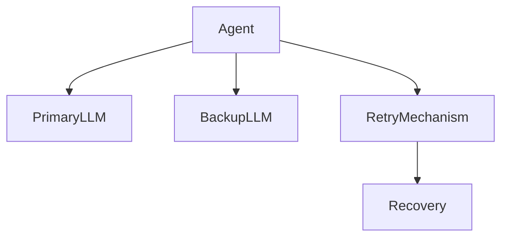

---

## Reliability Practices

* Retry mechanisms
* Fallback models
* Graceful degradation
* Circuit breakers

---

# Scalability

As adoption grows, agent workloads increase significantly.

---

## Horizontal Scaling

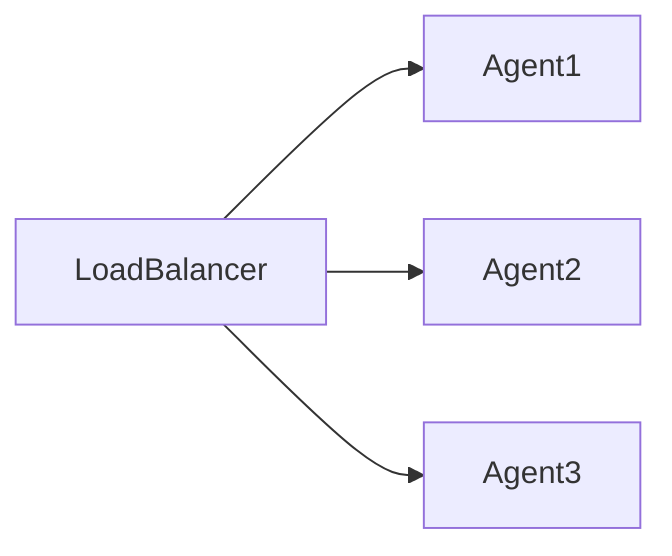

---

## Scalability Considerations

* Request volume
* Memory growth
* Tool concurrency
* Multi-agent workloads

---

# Cost Optimization

Production AI systems can become expensive.

---

## Cost Drivers

* LLM usage
* Token consumption
* Tool invocations
* Storage
* Infrastructure

---

## Optimization Strategies

### Model Selection

Use:

* Large models for complex tasks
* Smaller models for routine tasks

---

### Caching

Reduce repeated computations.

---

### Efficient Retrieval

Use RAG instead of large prompts.

---

### Intelligent Routing

Select the most cost-effective model.

---

# Security in Production

Production environments require strong security controls.

---

## Security Layers

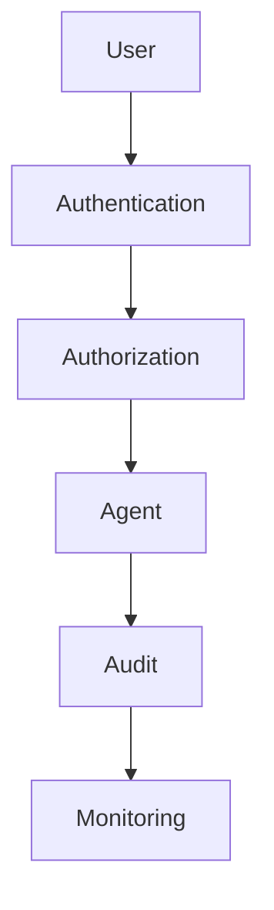

---

## Security Controls

* Identity management
* Role-based access
* Encryption
* Audit logging
* Data masking

---

# Governance

Enterprise AI Agents require governance frameworks.

---

## Governance Objectives

Ensure:

* Compliance
* Transparency
* Accountability
* Risk management

---

## Governance Model

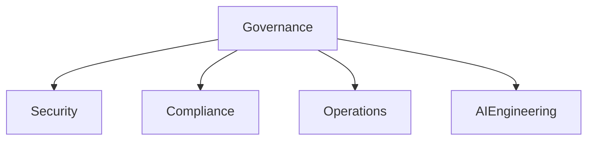

---

# Continuous Evaluation

Production AI systems require ongoing evaluation.

---

## Evaluation Areas

* Accuracy
* Safety
* Cost
* Reliability
* User satisfaction

---

## Evaluation Loop

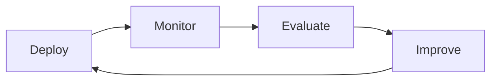

---

# MLOps and AgentOps

Production AI systems increasingly rely on operational disciplines.

---

## MLOps

Focuses on:

* Model lifecycle management
* Deployment automation
* Monitoring

---

## AgentOps

Focuses on:

* Agent lifecycle management
* Tool monitoring
* Memory management
* Workflow observability

---

## AgentOps Architecture

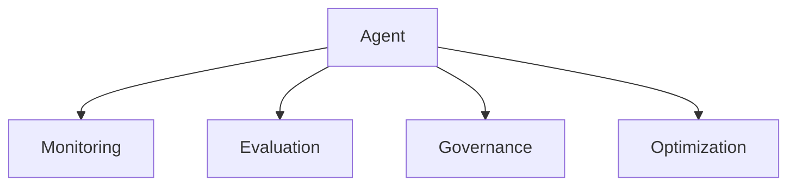

---

# Enterprise Production Use Cases

## Customer Support

Agents:

* Resolve tickets
* Access knowledge bases
* Escalate issues

---

## Software Engineering

Agents:

* Generate code
* Review code
* Execute tests

---

## Financial Services

Agents:

* Monitor transactions
* Detect fraud
* Support compliance

---

## Healthcare

Agents:

* Assist clinicians
* Retrieve medical knowledge
* Summarize records

---

# Future of Production AI Agents

Emerging trends include:

* Autonomous operations
* Self-healing agents
* Dynamic tool discovery
* Agent marketplaces
* Multi-agent orchestration platforms
* Enterprise digital workforces

Organizations will increasingly treat AI Agents as operational assets requiring governance, monitoring, security, and lifecycle management.

---

# Production Readiness Checklist

Before deployment, verify:

| Area                  | Status |
| --------------------- | ------ |
| Security Controls     | ✓      |
| Monitoring            | ✓      |
| Evaluation Framework  | ✓      |
| Human Oversight       | ✓      |
| Cost Management       | ✓      |
| Compliance Validation | ✓      |
| Reliability Testing   | ✓      |
| Scalability Testing   | ✓      |

---

# Key Takeaways

Production AI Agents require much more than advanced prompting or model selection.

Successful deployments require:

* Robust architectures
* Security controls
* Governance frameworks
* Monitoring systems
* Evaluation pipelines
* Scalability strategies

Organizations that adopt disciplined production practices will be best positioned to realize the full value of Agentic AI.

---

# Next Chapter

In the final chapter, **The Future of Agentic AI**, we will explore emerging trends, autonomous systems, AI-native organizations, digital workforces, and the long-term evolution of intelligent agents.
