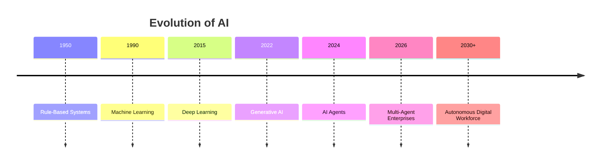
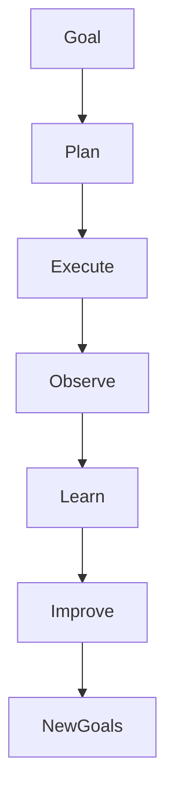
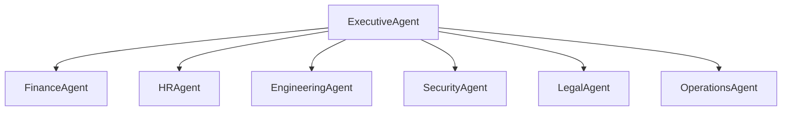
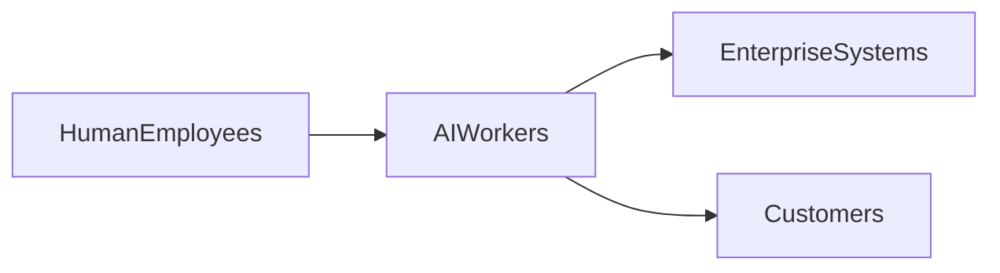
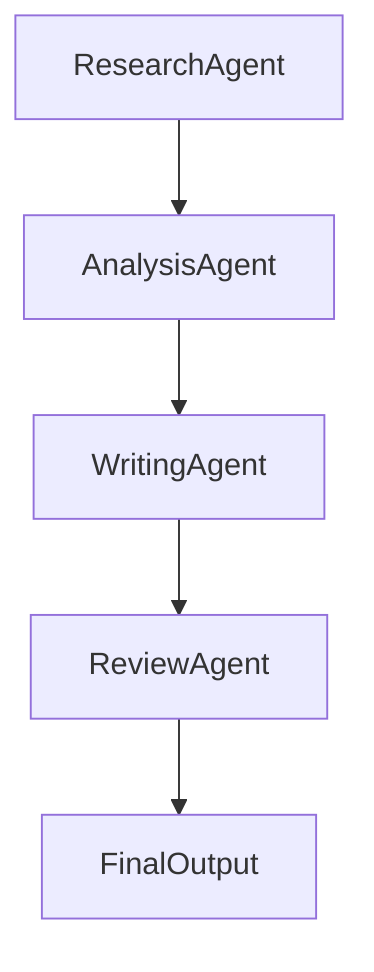
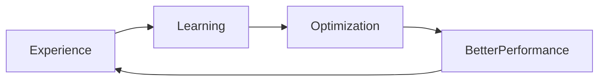
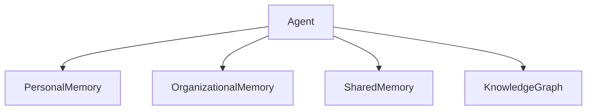
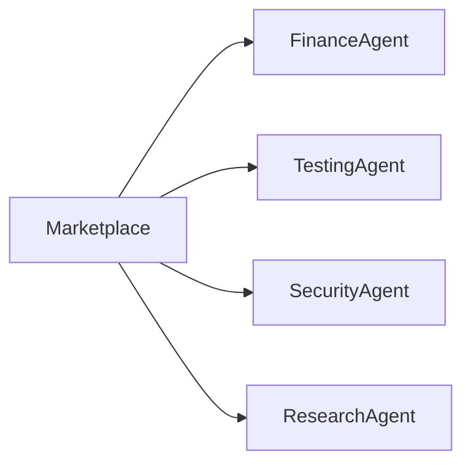
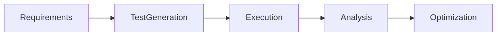
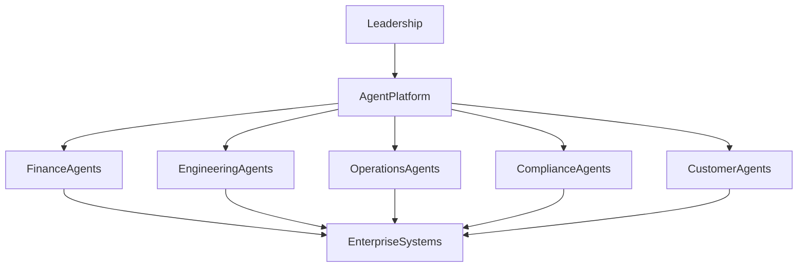

# Future of Agentic AI

## Overview

Artificial Intelligence is entering a new era.

Over the past decade, AI evolved from predictive analytics and machine learning models to generative AI systems capable of understanding and generating human language. The next evolution is **Agentic AI**—intelligent systems capable of reasoning, planning, acting, learning, and collaborating autonomously to achieve complex goals.

Agentic AI represents a fundamental shift from:

* AI as a tool
* To AI as a collaborator
* And eventually AI as an autonomous digital workforce

Organizations worldwide are investing heavily in AI Agents because they have the potential to transform how work is performed across every industry.

This chapter explores the future of Agentic AI, emerging trends, technological advancements, business implications, and the long-term vision of AI-powered enterprises.

---

# The Evolution of Artificial Intelligence

## Phase 1: Traditional AI

Characteristics:

* Rule-based systems
* Expert systems
* Statistical models

Examples:

* Decision trees
* Recommendation systems
* Fraud detection models

---

## Phase 2: Machine Learning

Characteristics:

* Pattern recognition
* Predictive analytics
* Data-driven decision making

Examples:

* Credit scoring
* Demand forecasting
* Customer segmentation

---

## Phase 3: Generative AI

Characteristics:

* Content generation
* Natural language understanding
* Conversational interfaces

Examples:

* ChatGPT
* Claude
* Gemini
* GitHub Copilot

---

## Phase 4: Agentic AI

Characteristics:

* Planning
* Reasoning
* Memory
* Tool usage
* Autonomous execution

Examples:

* Research agents
* Coding agents
* Enterprise copilots
* Autonomous digital workers

---

## Evolution Timeline



---

# What Makes Agentic AI Different?

Traditional AI responds.

Agentic AI acts.

Traditional systems answer questions.

Agentic systems pursue goals.

---

## Traditional AI Workflow


---

## Agentic AI Workflow


---

# The Rise of Autonomous Agents

Today's AI Agents require substantial human oversight.

Future agents will increasingly:

* Plan independently
* Discover tools automatically
* Coordinate with other agents
* Adapt to changing environments
* Learn from outcomes

---

## Autonomous Agent Lifecycle



---

# Multi-Agent Economies

Future AI ecosystems will consist of thousands of specialized agents working together.

Instead of one AI assistant, organizations may deploy:

* Finance agents
* Legal agents
* Security agents
* Research agents
* Engineering agents
* Compliance agents

Each agent specializes in a particular domain.

---

## Enterprise Multi-Agent Ecosystem



---

# AI-Native Enterprises

Many organizations today are digitally enabled.

Future organizations will become AI-native.

---

## Characteristics of AI-Native Organizations

### Human-AI Collaboration

Humans focus on:

* Strategy
* Creativity
* Leadership

Agents focus on:

* Execution
* Analysis
* Automation

---

### Continuous Intelligence

Decisions informed by:

* Real-time data
* Autonomous analysis
* Predictive insights

---

### Autonomous Operations

Routine processes executed by agents.

Examples:

* Incident management
* Customer support
* Compliance monitoring
* Financial reporting

---

# Digital Workforce Transformation

One of the most significant future trends is the emergence of digital workers.

A digital worker is an AI Agent capable of performing job functions traditionally handled by humans.

---

## Examples

### Digital Business Analyst

Responsibilities:

* Analyze requirements
* Create documentation
* Identify risks

---

### Digital Software Engineer

Responsibilities:

* Generate code
* Review code
* Create tests

---

### Digital Support Specialist

Responsibilities:

* Resolve customer issues
* Access knowledge bases
* Escalate complex cases

---

## Future Workforce Model



---

# Agent-to-Agent Collaboration

Future AI systems will increasingly communicate directly.

Instead of humans orchestrating workflows, agents will coordinate autonomously.

---

## Example

Research Agent:

```text
Find industry trends.
```

Analysis Agent:

```text
Interpret findings.
```

Writing Agent:

```text
Generate report.
```

Review Agent:

```text
Validate output.
```

---

## Agent Collaboration Framework



---

# Self-Improving Agents

Current agents largely depend on static prompts and configurations.

Future agents will:

* Learn from outcomes
* Adapt strategies
* Optimize workflows
* Improve tool selection

---

## Continuous Learning Loop



---

# Memory-Centric Intelligence

Memory systems will become increasingly sophisticated.

Future agents will maintain:

* Long-term memory
* Organizational knowledge
* Historical experiences
* Collaborative memory

---

## Future Memory Architecture



---

# AI Agent Marketplaces

Organizations may increasingly acquire agents the same way they acquire software today.

Future marketplaces could provide:

* Finance agents
* Testing agents
* Legal agents
* Security agents
* Healthcare agents

---

## Future Model



---

# Privacy-Enhancing Technologies

As Agentic AI adoption grows, privacy becomes increasingly important.

Emerging technologies include:

* Federated learning
* Differential privacy
* Confidential computing
* Homomorphic encryption
* Secure multi-party computation

These technologies will enable AI Agents to operate securely on sensitive information.

---

# Agent Governance Evolution

Future governance frameworks will become more sophisticated.

---

## Key Areas

### Accountability

Who is responsible for agent decisions?

### Transparency

How are decisions explained?

### Auditability

Can actions be traced?

### Compliance

Does behavior align with regulations?

---

# Future Regulatory Landscape

Governments worldwide are actively developing AI regulations.

Examples include:

* AI governance frameworks
* Digital accountability requirements
* AI safety standards
* Industry-specific regulations

Organizations should expect increasing regulatory oversight of autonomous AI systems.

---

# Industry Transformation

Agentic AI will impact nearly every industry.

---

## Financial Services

Future agents may:

* Detect fraud autonomously
* Perform compliance reviews
* Optimize portfolios

---

## Healthcare

Future agents may:

* Assist diagnosis
* Summarize patient histories
* Monitor treatment plans

---

## Manufacturing

Future agents may:

* Optimize production
* Predict equipment failures
* Manage supply chains

---

## Retail

Future agents may:

* Personalize shopping experiences
* Forecast demand
* Manage inventory

---

## Software Engineering

Future agents may:

* Design systems
* Write code
* Execute tests
* Deploy applications

---

# The Future of Quality Engineering

Quality Engineering will undergo significant transformation.

Future testing agents will:

* Generate test cases automatically
* Create synthetic test data
* Execute regression suites
* Analyze failures
* Perform root-cause analysis

---

## Autonomous Testing Lifecycle



---

# Challenges Ahead

Despite enormous potential, Agentic AI faces significant challenges.

---

## Technical Challenges

* Reliability
* Hallucinations
* Scalability
* Memory management

---

## Security Challenges

* Prompt injection
* Tool abuse
* Data leakage

---

## Governance Challenges

* Compliance
* Ethics
* Accountability

---

## Workforce Challenges

* Skill transformation
* Organizational change
* Human-AI collaboration

---

# Preparing for the Agentic Future

Organizations should begin preparing today.

---

## Recommended Actions

### Build Agent Literacy

Educate leaders and teams.

---

### Establish Governance

Create policies and controls.

---

### Experiment Early

Develop pilot programs.

---

### Invest in Platforms

Build scalable agent infrastructure.

---

### Focus on Human-AI Collaboration

Design workflows where humans and agents work together.

---

# Future Agent Maturity Model

| Level   | Description                  |
| ------- | ---------------------------- |
| Level 1 | Chatbots                     |
| Level 2 | Tool-Augmented Agents        |
| Level 3 | Memory-Enabled Agents        |
| Level 4 | Multi-Agent Systems          |
| Level 5 | Autonomous Digital Workforce |

---

# Vision: The Autonomous Enterprise

The long-term vision of Agentic AI is the autonomous enterprise.

Characteristics:

* Autonomous operations
* Self-optimizing workflows
* Continuous intelligence
* Human-supervised decision-making
* Digital workforces

---

## Autonomous Enterprise Architecture



---

# Key Takeaways

Agentic AI represents the next major evolution of artificial intelligence.

Future AI systems will increasingly:

* Reason
* Plan
* Act
* Learn
* Collaborate

Organizations will transition from isolated AI tools to interconnected ecosystems of specialized agents working alongside humans.

Key trends include:

* Autonomous agents
* Multi-agent systems
* Digital workforces
* AI-native enterprises
* Agent marketplaces
* Advanced memory systems
* Continuous learning

The organizations that begin building Agentic AI capabilities today will be best positioned to lead the next generation of digital transformation.

---

# Final Thoughts

The future of AI is not simply about smarter models.

It is about creating intelligent systems capable of understanding goals, collaborating with humans, making decisions, and delivering outcomes.

Agentic AI is the foundation of this future.

The journey has only just begun.

---

# Next Steps

Continue your learning by exploring:

* Agent Architecture Design
* Multi-Agent Systems
* Agent Evaluation Frameworks
* Agent Security and Governance
* AgentOps and Production Operations
* AI Agent Engineering Frameworks

The era of Agentic AI is here. The next generation of software systems will not simply execute instructions—they will understand objectives and work toward achieving them.
