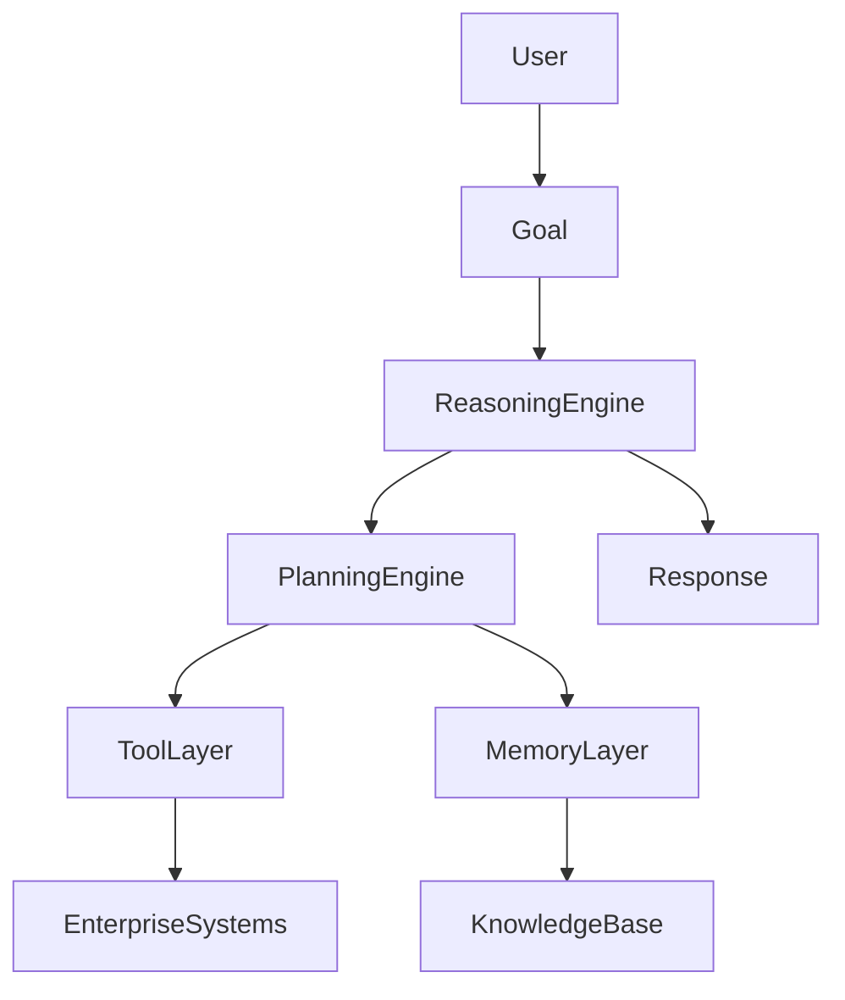
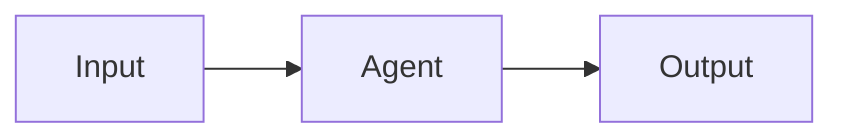
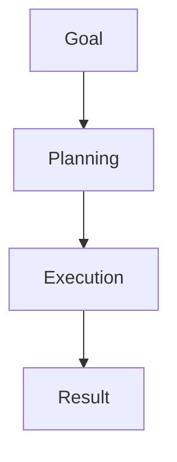
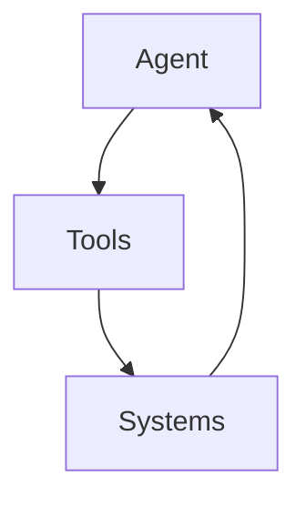
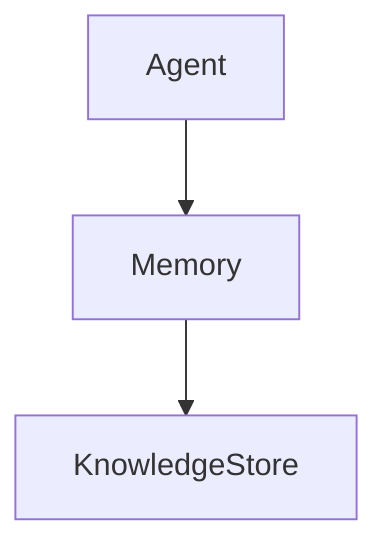
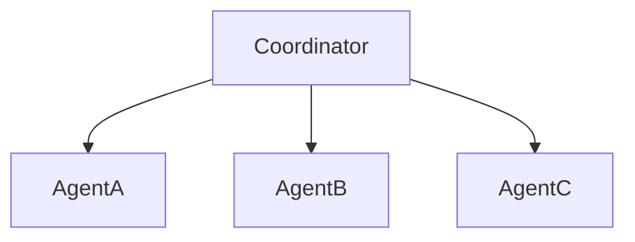
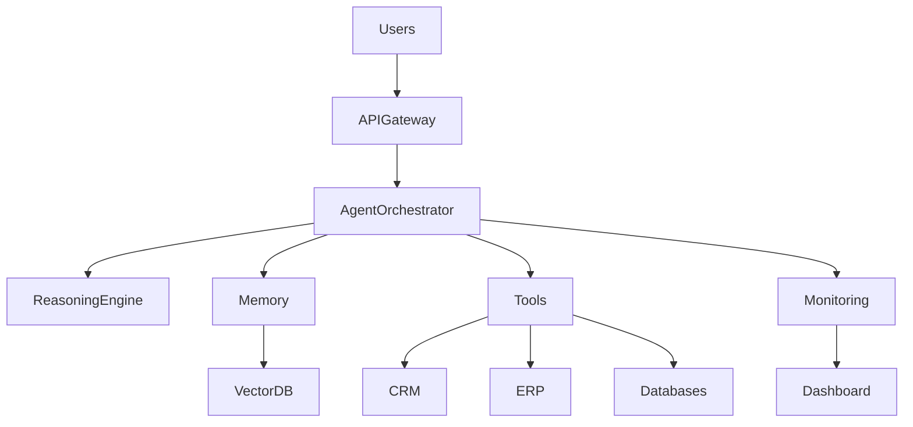

# Agent Design Framework

## Overview

Designing an effective AI Agent requires much more than selecting a Large Language Model (LLM) and writing a prompt.

Enterprise AI Agents must be designed with clear objectives, reasoning capabilities, memory systems, tool integrations, governance controls, evaluation mechanisms, and operational requirements.

A poorly designed agent often suffers from:

* Hallucinations
* Unpredictable behavior
* Excessive costs
* Security vulnerabilities
* Poor user experience
* Limited scalability

A well-designed agent operates as a reliable digital worker capable of delivering measurable business value.

This framework provides a structured methodology for designing production-ready AI Agents.

---

# What Is Agent Architecture?

Agent Architecture defines:

* How an agent thinks
* How it plans
* How it uses memory
* How it interacts with tools
* How it makes decisions
* How it collaborates with humans and other agents

Agent Architecture is the blueprint of an AI Agent system.

---

## High-Level Architecture



---

# Agent Design Principles

Successful AI Agents follow several design principles.

---

## Goal-Oriented Design

Agents should focus on outcomes rather than tasks.

### Poor Design

```text
Generate a report.
```

### Better Design

```text
Create an executive-ready quarterly risk assessment report with actionable recommendations.
```

The second objective is measurable and outcome-oriented.

---

## Modularity

Each component should have a clear responsibility.

Examples:

* Planning Module
* Memory Module
* Tool Module
* Evaluation Module

Benefits:

* Easier maintenance
* Better scalability
* Improved testing

---

## Explainability

Agents should provide reasoning behind decisions.

Example:

```text
Recommendation:
Increase test automation coverage.

Reason:
Regression execution time increased by 40%
over the last three releases.
```

---

## Human Oversight

Critical decisions should allow human intervention.

Examples:

* Financial approvals
* Healthcare recommendations
* Legal decisions

---

## Security by Design

Security controls should be embedded into the architecture rather than added later.

---

# The Agent Design Canvas

A useful approach is to define an Agent Design Canvas.

---

## 1. Business Objective

What problem is the agent solving?

Examples:

* Customer support
* Test automation
* Fraud detection
* Market research

---

## 2. Users

Who interacts with the agent?

Examples:

* Customers
* Developers
* Business analysts
* Executives

---

## 3. Expected Outcomes

What measurable value should be delivered?

Examples:

* Reduced support costs
* Faster software delivery
* Improved customer satisfaction

---

## 4. Constraints

Examples:

* Compliance requirements
* Security restrictions
* Budget limitations
* Performance targets

---

# Core Architectural Components

## Component 1: Reasoning Layer

Responsible for:

* Decision-making
* Problem-solving
* Analysis

### Responsibilities

* Interpret goals
* Evaluate options
* Determine next actions

---

## Component 2: Planning Layer

Transforms objectives into executable tasks.

### Example

Goal:

```text
Create a competitor analysis report.
```

Plan:

1. Research competitors
2. Gather data
3. Analyze trends
4. Generate report

---

## Component 3: Memory Layer

Stores information required for future actions.

### Memory Categories

| Type             | Purpose             |
| ---------------- | ------------------- |
| Working Memory   | Current session     |
| Episodic Memory  | Past experiences    |
| Semantic Memory  | Facts and knowledge |
| Long-Term Memory | Persistent storage  |

---

## Component 4: Tool Layer

Provides access to external capabilities.

Examples:

* APIs
* Databases
* Search engines
* Enterprise systems

---

## Component 5: Governance Layer

Responsible for:

* Security
* Compliance
* Monitoring
* Auditability

---

# Agent Architecture Patterns

---

## Pattern 1: Reactive Agent

Simple request-response model.



Best for:

* Chatbots
* FAQ systems

---

## Pattern 2: Planning Agent

Uses reasoning and task decomposition.



Best for:

* Research
* Analytics
* Knowledge work

---

## Pattern 3: Tool-Augmented Agent

Uses external tools to perform actions.



Best for:

* Enterprise automation
* Data retrieval

---

## Pattern 4: Memory-Enabled Agent

Maintains persistent context.



Best for:

* Personalized assistants
* Long-running workflows

---

## Pattern 5: Multi-Agent Architecture

Multiple specialized agents collaborate.



Best for:

* Complex enterprise workflows

---

# Agent Design Decision Matrix

| Requirement            | Recommended Pattern  |
| ---------------------- | -------------------- |
| Simple Q&A             | Reactive Agent       |
| Task Execution         | Planning Agent       |
| Enterprise Integration | Tool-Augmented Agent |
| Personalization        | Memory Agent         |
| Large-Scale Automation | Multi-Agent System   |

---

# Enterprise Agent Reference Architecture



---

# Designing for Reliability

Key considerations:

### Retry Mechanisms

Recover from temporary failures.

### Fallback Models

Switch to alternative models when needed.

### Graceful Degradation

Continue operating when services fail.

### Error Recovery

Detect and recover automatically.

---

# Designing for Scalability

Strategies include:

* Stateless execution
* Distributed architecture
* Load balancing
* Queue-based processing

---

# Designing for Security

Security controls should include:

* Authentication
* Authorization
* Data masking
* Encryption
* Audit logging

---

# Designing for Evaluation

Every agent should define:

| Metric            | Purpose     |
| ----------------- | ----------- |
| Accuracy          | Correctness |
| Latency           | Speed       |
| Cost              | Efficiency  |
| Reliability       | Stability   |
| User Satisfaction | Experience  |

---

# Agent Design Review Checklist

Before deployment, verify:

### Business Alignment

* Clear objectives defined
* Success metrics established

### Architecture

* Appropriate pattern selected
* Scalability addressed

### Security

* Access controls implemented
* Data protection enabled

### Operations

* Monitoring configured
* Logging enabled

### Evaluation

* KPIs defined
* Testing completed

---

# Common Design Mistakes

## Overloading One Agent

Trying to solve every problem with a single agent.

---

## Ignoring Memory Design

Failing to manage context effectively.

---

## Excessive Tool Usage

Creating unnecessary complexity.

---

## Weak Governance

Lack of security and compliance controls.

---

## Missing Evaluation Strategy

No mechanism to measure success.

---

# Future of Agent Architecture

Emerging trends include:

* Autonomous planning systems
* Dynamic agent creation
* Agent marketplaces
* Self-healing architectures
* Adaptive reasoning frameworks
* Enterprise agent operating systems

Future AI architectures will increasingly resemble organizational structures, with specialized agents collaborating to achieve business goals.

---

# Key Takeaways

Effective Agent Design requires balancing:

* Intelligence
* Reliability
* Security
* Scalability
* Governance

A structured design framework enables organizations to build AI Agents that are trustworthy, maintainable, and production-ready.

The most successful agents are not necessarily the most intelligent—they are the ones that consistently deliver measurable business outcomes.
