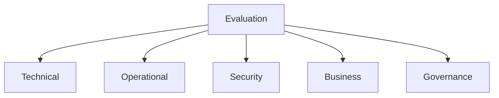
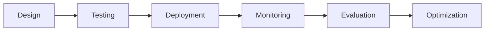

# Evaluation Scorecard

## Overview

Building an AI Agent is not the ultimate goal. The true measure of success is whether the agent consistently delivers business value while maintaining accuracy, reliability, security, compliance, and cost efficiency.

Organizations often focus heavily on:

* Model selection
* Prompt engineering
* Tool integration
* Agent architecture

However, many deployments fail because there is no structured framework for measuring success.

An **Evaluation Scorecard** provides a standardized approach to assess AI Agents across technical, operational, business, and governance dimensions.

This framework can be used for:

* Agent certification
* Production readiness reviews
* Vendor assessments
* Continuous monitoring
* Executive reporting
* AI governance programs

---

# Why Evaluation Scorecards Matter

Traditional software systems are evaluated using deterministic testing.

AI Agents are different because they:

* Generate probabilistic outputs
* Adapt behavior dynamically
* Interact with tools
* Use memory
* Make autonomous decisions

Organizations require a broader evaluation framework.

---

## Evaluation Objectives

Measure:

* Accuracy
* Reliability
* Safety
* Performance
* Cost
* Business impact
* User experience
* Governance compliance

---

## Enterprise Evaluation Model



---

# Scorecard Structure

The scorecard consists of five major dimensions.

| Dimension               | Weight |
| ----------------------- | ------ |
| Technical Quality       | 30%    |
| Operational Excellence  | 20%    |
| Security & Safety       | 20%    |
| Business Value          | 20%    |
| Governance & Compliance | 10%    |

Total Score:

```text
100 Points
```

---

# Dimension 1: Technical Quality

## Objective

Measure the agent's ability to perform assigned tasks accurately and effectively.

---

## Evaluation Areas

| Area               | Description                |
| ------------------ | -------------------------- |
| Accuracy           | Correctness of outputs     |
| Reasoning Quality  | Logic and decision-making  |
| Tool Usage         | Effective tool selection   |
| Memory Performance | Context retention          |
| Response Quality   | Completeness and relevance |

---

## Technical Scorecard

| Metric                 | Weight | Score |
| ---------------------- | ------ | ----- |
| Accuracy               | 10     |       |
| Reasoning Quality      | 5      |       |
| Tool Usage Accuracy    | 5      |       |
| Memory Recall Accuracy | 5      |       |
| Response Quality       | 5      |       |

Maximum:

```text
30 Points
```

---

## Scoring Guidelines

### Accuracy

| Score | Definition        |
| ----- | ----------------- |
| 5     | Excellent         |
| 4     | Very Good         |
| 3     | Acceptable        |
| 2     | Needs Improvement |
| 1     | Poor              |

---

# Dimension 2: Operational Excellence

## Objective

Measure reliability, scalability, and operational performance.

---

## Evaluation Areas

| Area          | Description              |
| ------------- | ------------------------ |
| Reliability   | Stability of execution   |
| Availability  | System uptime            |
| Performance   | Response speed           |
| Scalability   | Growth handling          |
| Observability | Monitoring effectiveness |

---

## Operational Scorecard

| Metric        | Weight |
| ------------- | ------ |
| Reliability   | 5      |
| Availability  | 5      |
| Performance   | 5      |
| Scalability   | 3      |
| Observability | 2      |

Maximum:

```text
20 Points
```

---

## Example Metrics

### Reliability

Formula:

---

### Availability

Target:

```text
99.9%+
```

for enterprise deployments.

---

# Dimension 3: Security and Safety

## Objective

Assess trustworthiness and risk management.

---

## Evaluation Areas

| Area                | Description             |
| ------------------- | ----------------------- |
| Authentication      | Identity verification   |
| Authorization       | Access control          |
| Data Protection     | Sensitive data security |
| Safety Controls     | Harm prevention         |
| Compliance Controls | Regulatory adherence    |

---

## Security Scorecard

| Metric          | Weight |
| --------------- | ------ |
| Authentication  | 4      |
| Authorization   | 4      |
| Data Security   | 4      |
| Safety Controls | 4      |
| Compliance      | 4      |

Maximum:

```text
20 Points
```

---

## Security Assessment Questions

### Authentication

* Are identities verified?
* Are service accounts managed securely?

### Authorization

* Is least privilege enforced?
* Are permissions role-based?

### Data Security

* Is encryption enabled?
* Is sensitive data masked?

---

# Dimension 4: Business Value

## Objective

Measure organizational impact.

---

## Evaluation Areas

| Area                     | Description         |
| ------------------------ | ------------------- |
| Productivity Improvement | Efficiency gains    |
| Cost Reduction           | Operational savings |
| User Satisfaction        | Experience quality  |
| Adoption                 | Usage growth        |
| ROI                      | Business return     |

---

## Business Scorecard

| Metric                   | Weight |
| ------------------------ | ------ |
| Productivity Improvement | 5      |
| Cost Reduction           | 5      |
| User Satisfaction        | 4      |
| Adoption Rate            | 3      |
| ROI                      | 3      |

Maximum:

```text
20 Points
```

---

## Business KPI Examples

### Productivity Gain

---

### ROI

---

# Dimension 5: Governance and Compliance

## Objective

Evaluate accountability, transparency, and regulatory readiness.

---

## Evaluation Areas

| Area                  | Description           |
| --------------------- | --------------------- |
| Auditability          | Traceability          |
| Transparency          | Explainability        |
| Risk Management       | Risk controls         |
| Policy Enforcement    | Governance compliance |
| Regulatory Compliance | Legal adherence       |

---

## Governance Scorecard

| Metric                | Weight |
| --------------------- | ------ |
| Audit Logging         | 2      |
| Transparency          | 2      |
| Risk Controls         | 2      |
| Policy Compliance     | 2      |
| Regulatory Compliance | 2      |

Maximum:

```text
10 Points
```

---

# Enterprise Evaluation Dashboard

## Executive View

| Category               | Maximum | Actual |
| ---------------------- | ------- | ------ |
| Technical Quality      | 30      |        |
| Operational Excellence | 20      |        |
| Security & Safety      | 20      |        |
| Business Value         | 20      |        |
| Governance             | 10      |        |

Total:

```text
100 Points
```

---

# Production Readiness Levels

## Level 1 – Experimental

Characteristics:

* Prototype stage
* Limited testing
* No governance

Score:

```text
0–40
```

---

## Level 2 – Pilot

Characteristics:

* Initial users
* Basic monitoring
* Partial governance

Score:

```text
41–60
```

---

## Level 3 – Production Ready

Characteristics:

* Reliable operations
* Security controls
* Monitoring enabled

Score:

```text
61–80
```

---

## Level 4 – Enterprise Grade

Characteristics:

* Full governance
* Scalable architecture
* Strong reliability

Score:

```text
81–90
```

---

## Level 5 – Best-in-Class

Characteristics:

* Advanced automation
* Continuous evaluation
* Enterprise-wide adoption

Score:

```text
91–100
```

---

# AI Agent Maturity Assessment

## Technical Maturity

| Level | Characteristics              |
| ----- | ---------------------------- |
| 1     | Basic chatbot                |
| 2     | Tool-enabled agent           |
| 3     | Memory-enabled agent         |
| 4     | Multi-agent system           |
| 5     | Autonomous digital workforce |

---

## Governance Maturity

| Level | Characteristics                  |
| ----- | -------------------------------- |
| 1     | No governance                    |
| 2     | Basic controls                   |
| 3     | Defined policies                 |
| 4     | Enterprise governance            |
| 5     | Continuous governance automation |

---

# Evaluation Workflow



---

# Continuous Evaluation Framework

Evaluation should not stop after deployment.

Organizations should implement:

### Daily

* Operational monitoring
* Security reviews

### Weekly

* Performance assessment
* Cost analysis

### Monthly

* Business KPI review
* User satisfaction analysis

### Quarterly

* Governance audits
* Maturity assessments

---

# Sample Enterprise Agent Assessment

## Customer Support Agent

| Category               | Score |
| ---------------------- | ----- |
| Technical Quality      | 26/30 |
| Operational Excellence | 17/20 |
| Security & Safety      | 18/20 |
| Business Value         | 16/20 |
| Governance             | 9/10  |

Total:

```text
86/100
```

Classification:

```text
Enterprise Grade
```

---

# Common Evaluation Mistakes

## Measuring Only Accuracy

Agents should also be evaluated for:

* Safety
* Reliability
* Business value

---

## Ignoring User Experience

Technically correct outputs may still fail user expectations.

---

## Neglecting Governance

Compliance and risk controls are essential.

---

## No Continuous Monitoring

Evaluation must continue after deployment.

---

# Best Practices

## Define Success Metrics Early

Establish KPIs before development begins.

---

## Combine Human and Automated Evaluation

Use both approaches for balanced assessment.

---

## Evaluate End-to-End Workflows

Do not focus solely on individual responses.

---

## Track Business Outcomes

Measure organizational value.

---

## Review Regularly

Update evaluation criteria as agents evolve.

---

# Future of Agent Evaluation

Future AI ecosystems will increasingly use:

* AI-powered evaluation agents
* Autonomous benchmarking systems
* Continuous red teaming
* Real-time governance scoring
* Dynamic risk assessment
* Self-evaluating agents

Evaluation will become a continuous, automated discipline embedded within every enterprise AI platform.

---

# Key Takeaways

An Evaluation Scorecard provides a structured framework for measuring AI Agent effectiveness across:

* Technical Quality
* Operational Excellence
* Security & Safety
* Business Value
* Governance & Compliance

Organizations that implement formal evaluation frameworks will be better positioned to deploy trustworthy, scalable, and high-performing AI Agents while maintaining accountability and regulatory compliance.

A successful AI Agent is not simply one that generates answers—it is one that consistently delivers measurable business outcomes safely, reliably, and efficiently.
