# Orchestration Models

## Overview

As AI Agents become more sophisticated, managing the interaction between reasoning, planning, memory, tools, workflows, and multiple agents becomes increasingly complex.

This coordination layer is known as **Agent Orchestration**.

Orchestration determines:

* How tasks are assigned
* How workflows are executed
* How agents communicate
* How tools are invoked
* How decisions are managed
* How outcomes are monitored

Without orchestration, AI Agents operate as isolated components. With orchestration, they become intelligent systems capable of executing enterprise-scale workflows.

---

# What Is Agent Orchestration?

Agent Orchestration is the process of coordinating AI agents, tools, memory systems, and business workflows to achieve a specific goal.

Think of orchestration as the "operating system" of an AI Agent platform.

---

## Human Organization Analogy

In a company:

* Employees perform tasks
* Managers assign work
* Teams collaborate
* Processes govern execution

Similarly:

* Agents perform tasks
* Orchestrators assign work
* Agent teams collaborate
* Workflows govern execution

---

## High-Level Architecture

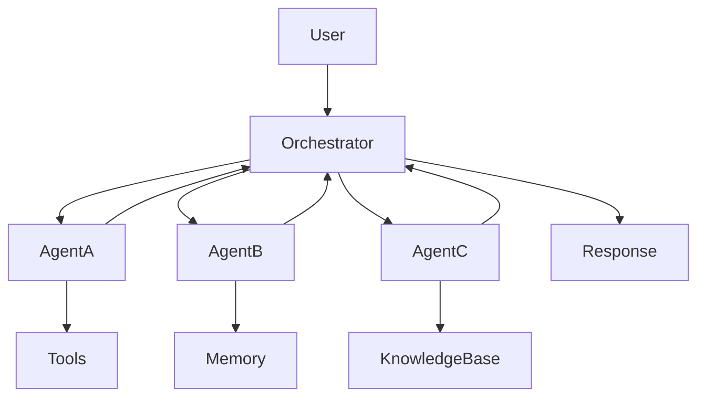

---

# Why Orchestration Matters

Without orchestration:

* Tasks become fragmented
* Agents duplicate work
* Tool usage becomes inefficient
* Costs increase
* Governance becomes difficult

With orchestration:

* Workflows become structured
* Responsibilities are clear
* Monitoring improves
* Systems scale efficiently

---

# Core Responsibilities of an Orchestrator

## Task Management

Responsible for:

* Receiving goals
* Creating tasks
* Tracking execution

---

## Agent Coordination

Responsible for:

* Assigning work
* Managing dependencies
* Aggregating outputs

---

## Tool Management

Responsible for:

* Tool selection
* Execution control
* Error handling

---

## Memory Coordination

Responsible for:

* Context sharing
* Knowledge retrieval
* State management

---

## Governance

Responsible for:

* Security
* Compliance
* Auditability

---

# Orchestration Lifecycle

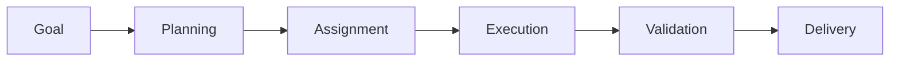

---

# Orchestration Models

Different business scenarios require different orchestration approaches.

---

# Model 1: Sequential Orchestration

Tasks execute one after another.

---

## Workflow

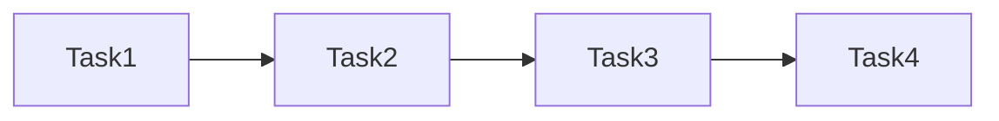

---

## Example

Software Testing Workflow:

1. Analyze requirements
2. Generate test cases
3. Create test data
4. Execute tests

---

## Advantages

* Easy to implement
* Predictable execution
* Simplified monitoring

---

## Limitations

* Slower execution
* Limited scalability

---

## Best Use Cases

* Document generation
* Approval processes
* Testing workflows

---

# Model 2: Parallel Orchestration

Multiple tasks execute simultaneously.

---

## Workflow

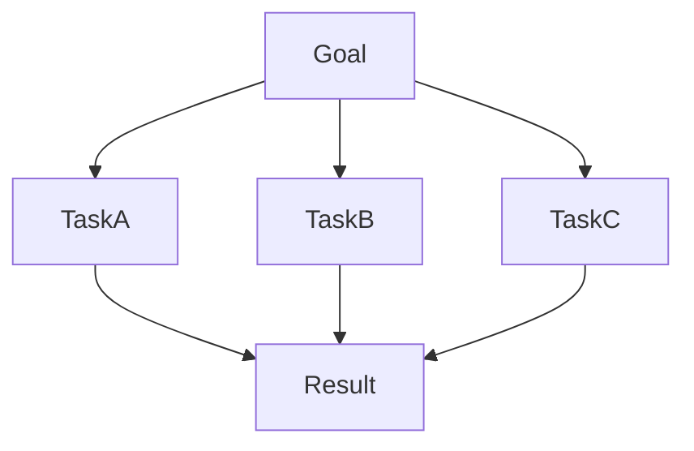

---

## Example

Market Research Project:

* Competitor Analysis
* Technology Research
* Regulatory Review

All activities run concurrently.

---

## Advantages

* Faster execution
* Improved scalability

---

## Challenges

* Increased coordination complexity

---

# Model 3: Manager-Worker Orchestration

A central coordinator delegates work to specialized agents.

---

## Architecture

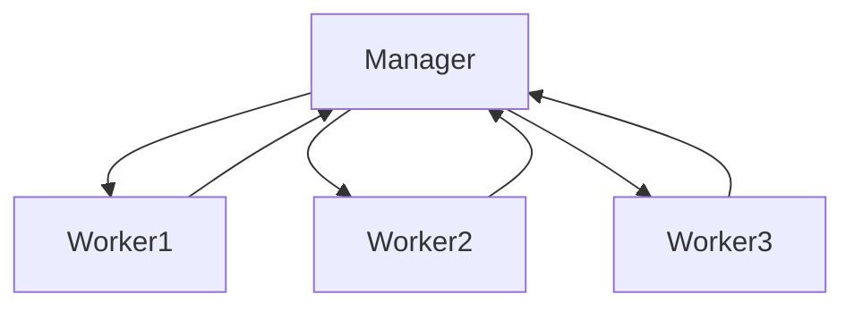

---

## Responsibilities

### Manager Agent

* Planning
* Assignment
* Monitoring

### Worker Agents

* Task execution
* Result generation

---

## Enterprise Example

Testing Agent Platform:

| Agent    | Responsibility       |
| -------- | -------------------- |
| Manager  | Coordinate testing   |
| Worker 1 | Test generation      |
| Worker 2 | Test data generation |
| Worker 3 | Defect analysis      |

---

# Model 4: Hierarchical Orchestration

Uses multiple layers of coordination.

---

## Architecture

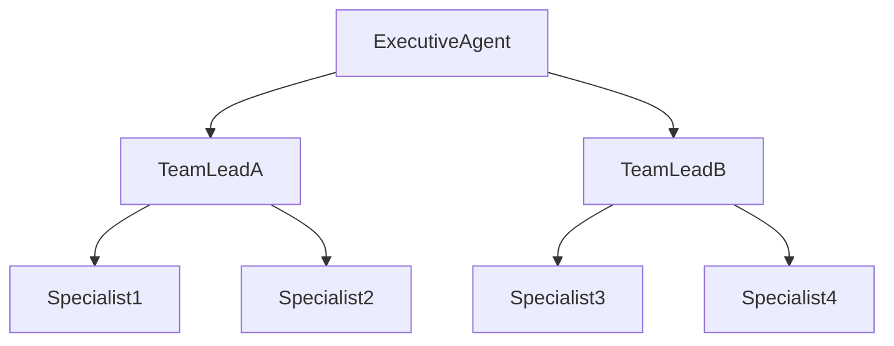

---

## Benefits

* Enterprise scalability
* Clear responsibility structure

---

## Use Cases

* Large organizations
* Enterprise AI platforms
* Digital workforce management

---

# Model 5: Event-Driven Orchestration

Execution is triggered by events.

---

## Architecture

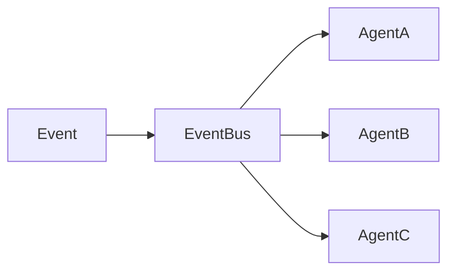

---

## Examples

Events:

* New customer request
* Fraud alert
* Security incident
* Payment failure

---

## Advantages

* Real-time processing
* High scalability

---

# Model 6: Blackboard Orchestration

Agents collaborate through shared memory.

---

## Architecture

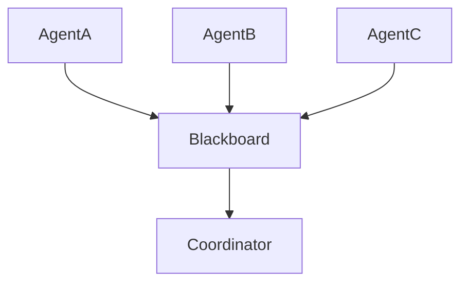

---

## Benefits

* Knowledge sharing
* Reduced communication complexity

---

## Common Use Cases

* Research systems
* Knowledge management
* Collaborative analysis

---

# Model 7: Swarm Orchestration

Agents self-organize dynamically.

---

## Architecture

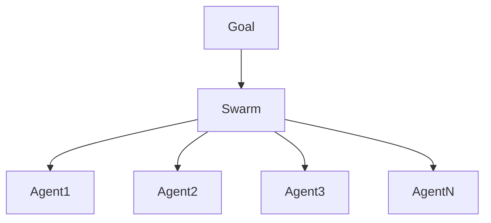

---

## Characteristics

* No fixed hierarchy
* Dynamic collaboration
* Adaptive behavior

---

## Future Applications

* Autonomous enterprises
* Large-scale agent ecosystems

---

# Orchestration Patterns

---

# Pattern 1: Pipeline Pattern

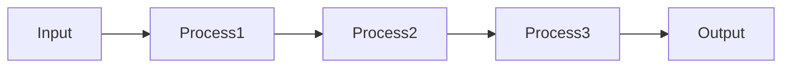

Best for:

* ETL workflows
* Test automation pipelines

---

# Pattern 2: Fan-Out/Fan-In Pattern

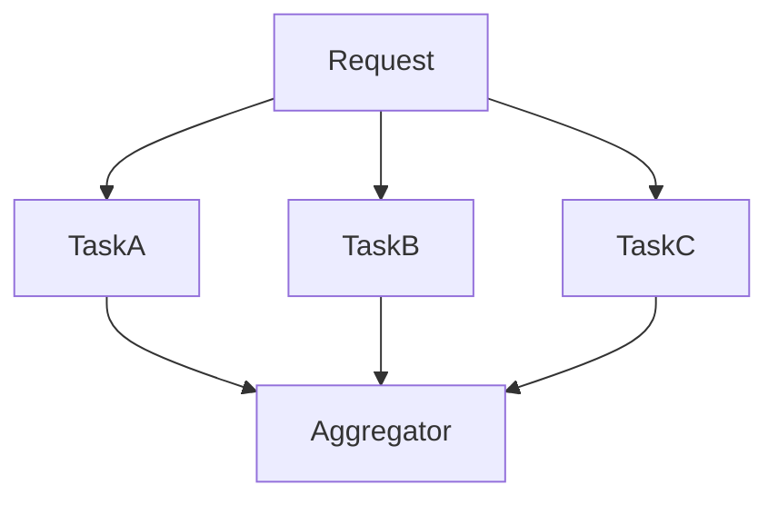

Best for:

* Research
* Data analysis

---

# Pattern 3: Approval Pattern

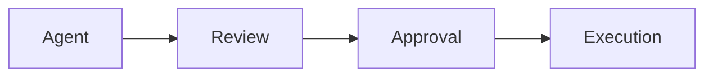

Best for:

* Finance
* Healthcare
* Compliance

---

# Memory-Oriented Orchestration

Modern orchestrators coordinate memory usage.

---

## Responsibilities

* Context retention
* Shared memory updates
* Knowledge retrieval

---

## Architecture

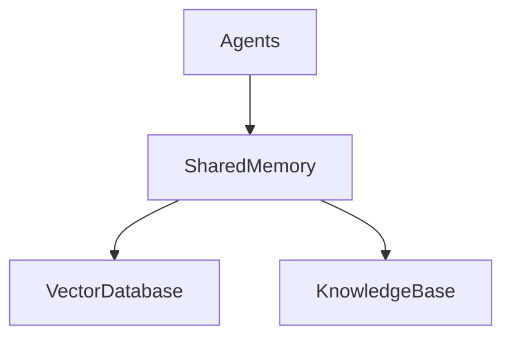

---

# Tool-Oriented Orchestration

Many workflows involve multiple tools.

---

## Example

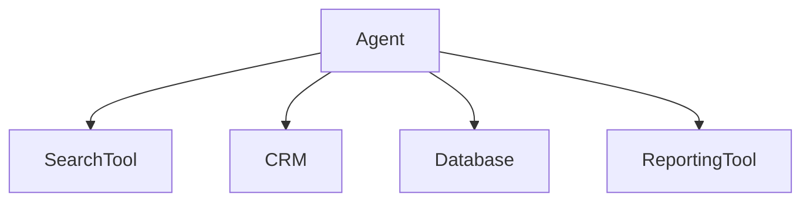

---

## Orchestrator Responsibilities

* Tool routing
* Error handling
* Retry management

---

# Multi-Agent Orchestration

Enterprise systems often involve multiple specialized agents.

---

## Example

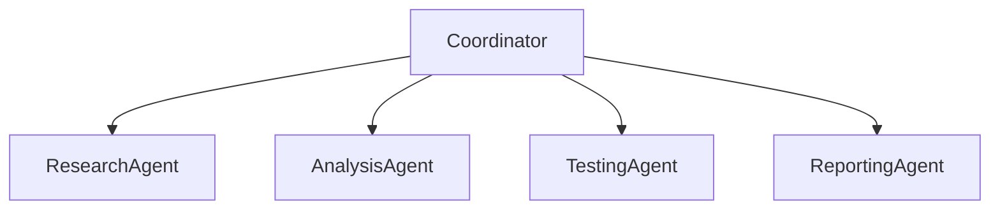

---

## Benefits

* Specialization
* Scalability
* Quality improvement

---

# Orchestration and Governance

Production systems require governance controls.

---

## Governance Areas

| Area       | Purpose                |
| ---------- | ---------------------- |
| Security   | Access control         |
| Compliance | Regulatory adherence   |
| Monitoring | Operational visibility |
| Audit      | Traceability           |

---

# Observability in Orchestration

Organizations should monitor:

* Agent performance
* Workflow execution
* Tool usage
* Costs
* Failures

---

## Monitoring Architecture

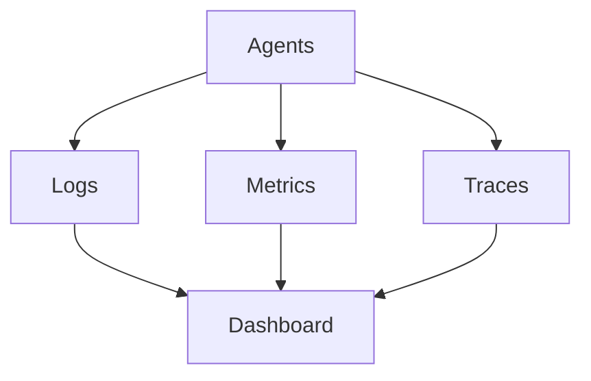

---

# Orchestration Evaluation Metrics

| Metric                | Description            |
| --------------------- | ---------------------- |
| Workflow Success Rate | Completed workflows    |
| Task Completion Rate  | Successful tasks       |
| Agent Utilization     | Resource efficiency    |
| Cost per Workflow     | Operational efficiency |
| Latency               | Execution speed        |
| Reliability           | Stability              |

---

# Enterprise Orchestration Framework

A modern enterprise orchestration platform includes:

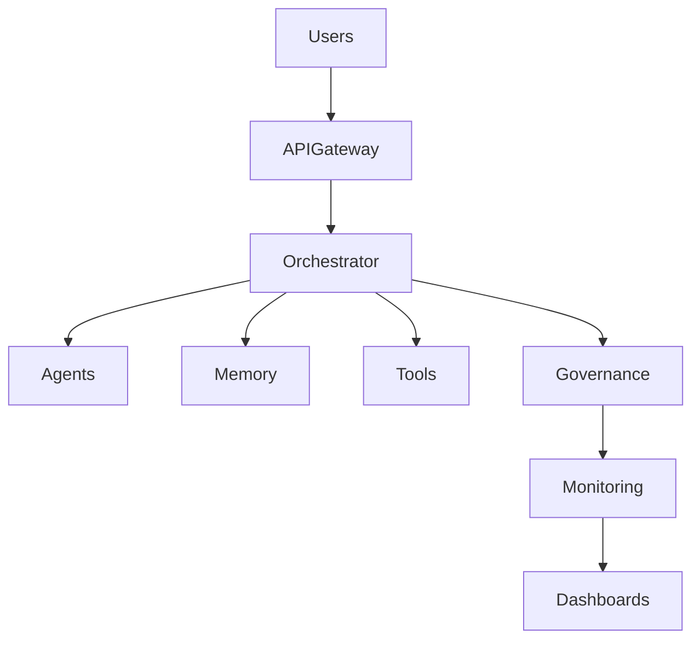

---

# Common Orchestration Challenges

## Coordination Complexity

Managing large numbers of agents.

---

## Workflow Failures

Handling partial execution failures.

---

## Cost Management

Controlling LLM and infrastructure costs.

---

## Security Risks

Protecting systems and data.

---

## Scalability

Supporting enterprise workloads.

---

# Best Practices

## Keep Agents Specialized

Avoid overly general-purpose agents.

---

## Centralize Governance

Apply consistent policies.

---

## Monitor Continuously

Track workflows and outcomes.

---

## Design for Failure

Implement retries and fallback mechanisms.

---

## Optimize Costs

Use intelligent model routing and caching.

---

# Future of Orchestration

Future orchestration platforms will evolve into full **Agent Operating Systems (AgentOS)** capable of:

* Dynamic agent creation
* Autonomous task assignment
* Self-healing workflows
* Intelligent resource allocation
* Cross-organizational collaboration

These platforms will become the foundation of AI-native enterprises.

---

# Key Takeaways

Orchestration is the control layer that transforms individual AI Agents into coordinated enterprise systems.

Successful orchestration enables:

* Scalability
* Reliability
* Governance
* Collaboration
* Cost efficiency

Organizations building production AI Agents should invest heavily in orchestration architectures, as they are the backbone of modern Agentic AI platforms.
