# Reasoning Patterns

## Overview

Reasoning is the capability that differentiates an AI Agent from a traditional software application.

While conventional systems follow predefined instructions, AI Agents analyze situations, evaluate alternatives, make decisions, and determine actions dynamically.

The quality of an AI Agent is largely determined by the quality of its reasoning process.

Effective reasoning enables agents to:

* Solve complex problems
* Break down large tasks
* Make informed decisions
* Use tools intelligently
* Adapt to changing conditions
* Explain recommendations

This document introduces the most important reasoning patterns used in modern AI Agent systems and provides guidance on selecting the appropriate pattern for different use cases.

---

# What Is Reasoning?

Reasoning is the process of transforming information into decisions or actions.

A typical reasoning cycle includes:

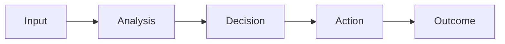

---

## Example

User Request:

```text
Create a software testing strategy for a digital banking application.
```

The agent must:

1. Understand the request
2. Identify the application type
3. Determine testing requirements
4. Recommend testing approaches
5. Produce a structured strategy

This process requires reasoning rather than simple retrieval.

---

# Why Reasoning Matters

Without structured reasoning, agents may:

* Produce inconsistent answers
* Miss important information
* Select incorrect tools
* Generate low-quality recommendations

Strong reasoning improves:

| Capability     | Impact                      |
| -------------- | --------------------------- |
| Accuracy       | Better decisions            |
| Reliability    | Consistent outcomes         |
| Explainability | Transparent recommendations |
| Adaptability   | Handles new situations      |
| Efficiency     | Reduces unnecessary actions |

---

# Reasoning Architecture

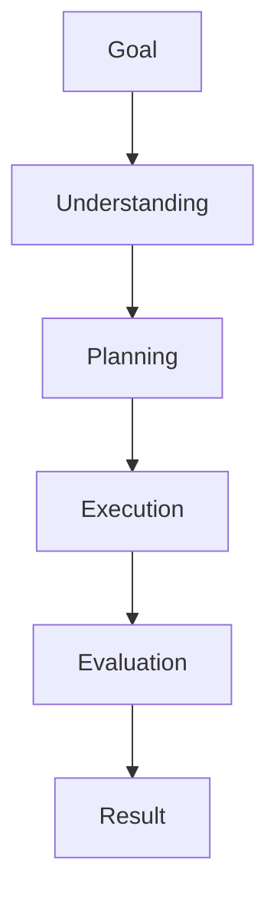

---

# Types of Reasoning

Modern AI Agents employ several reasoning patterns depending on the complexity of the task.

---

# Pattern 1: Direct Reasoning

## Definition

The simplest reasoning pattern.

The agent immediately generates an answer from the available information.

---

## Workflow

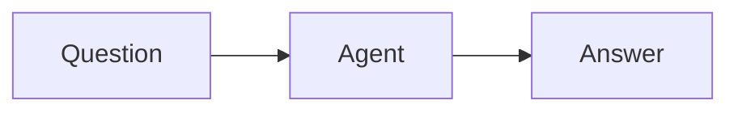

---

## Example

Question:

```text
What is PCI DSS?
```

Response:

```text
PCI DSS is a security standard designed to protect payment card data.
```

---

## Best Use Cases

* FAQs
* Simple knowledge retrieval
* Basic customer support

---

## Advantages

* Fast
* Low cost
* Simple implementation

---

## Limitations

* Limited problem-solving capability
* Poor handling of complex tasks

---

# Pattern 2: Chain-of-Thought Reasoning

## Definition

The agent breaks a problem into intermediate reasoning steps before reaching a conclusion.

---

## Workflow

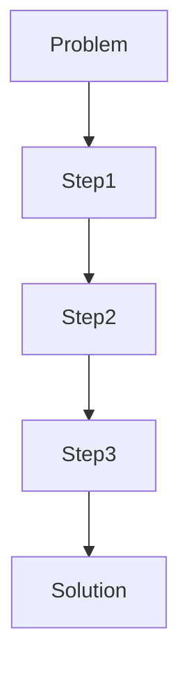

---

## Example

Problem:

```text
A payment transaction failed.
Determine the root cause.
```

Reasoning:

1. Check transaction status
2. Review authorization response
3. Analyze issuer response code
4. Determine failure reason

---

## Best Use Cases

* Business analysis
* Software testing
* Root cause analysis
* Troubleshooting

---

## Advantages

* Improved accuracy
* Better transparency
* More reliable conclusions

---

# Pattern 3: Tree-of-Thought Reasoning

## Definition

The agent explores multiple reasoning paths before selecting the best option.

---

## Workflow

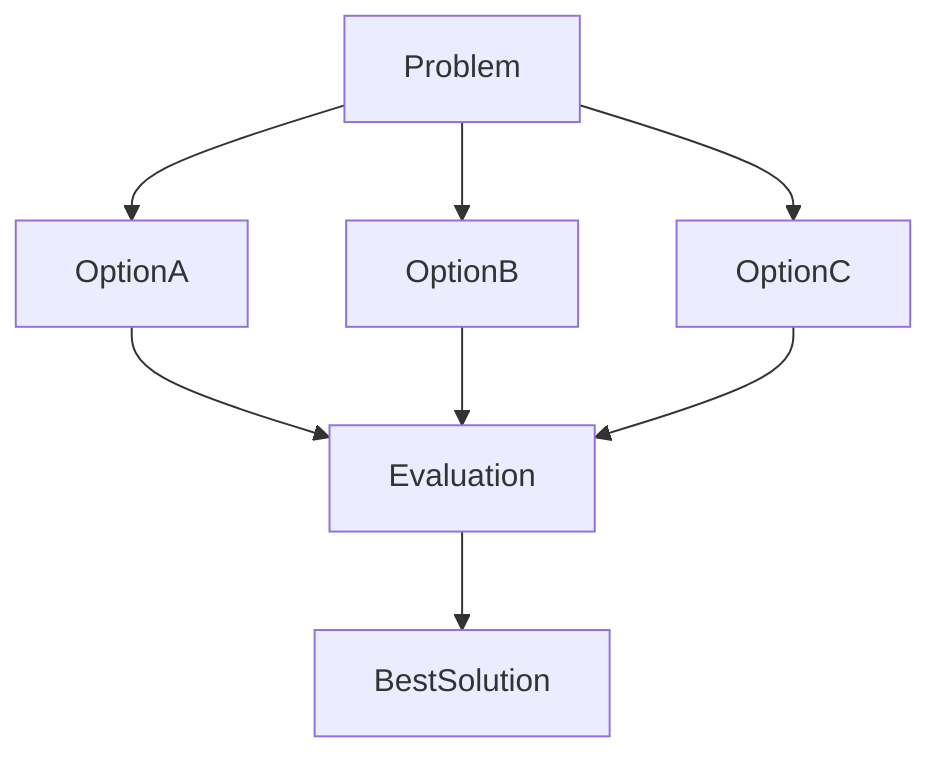

---

## Example

Task:

```text
Select the best cloud migration strategy.
```

Alternatives:

* Rehost
* Refactor
* Replatform

The agent evaluates each approach before making a recommendation.

---

## Best Use Cases

* Strategic planning
* Architecture design
* Decision support

---

## Advantages

* Better decision quality
* Consideration of alternatives

---

# Pattern 4: ReAct (Reason + Act)

## Definition

The agent alternates between reasoning and tool execution.

---

## Workflow

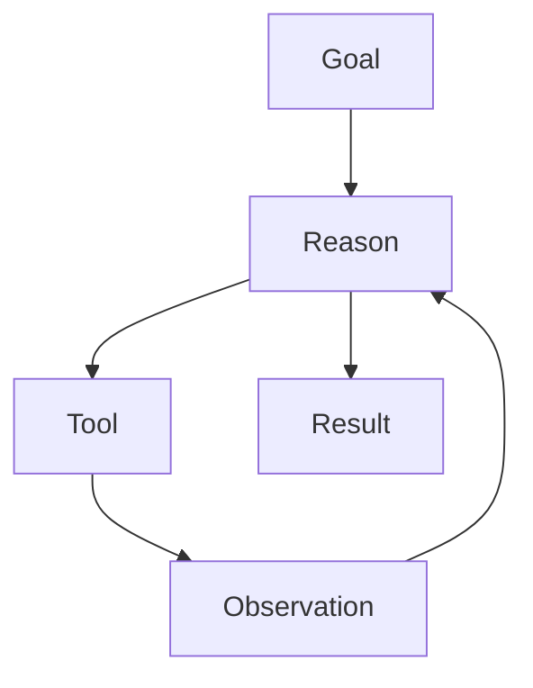

---

## Example

User Request:

```text
Find the latest AI Agent market trends.
```

Agent Process:

1. Determine information needed
2. Search external sources
3. Analyze findings
4. Produce insights

---

## Best Use Cases

* Research agents
* Web-enabled assistants
* Enterprise copilots

---

## Advantages

* Dynamic decision making
* Real-time information access

---

# Pattern 5: Reflection Reasoning

## Definition

The agent reviews its own output before finalizing a response.

---

## Workflow

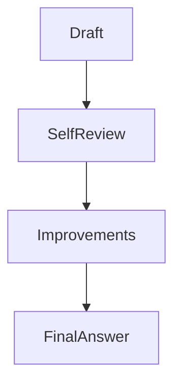

---

## Example

Initial Output:

```text
Security assessment completed.
```

Reflection:

```text
Have compliance requirements been considered?
```

Improved Output:

```text
Security assessment includes PCI DSS,
GDPR, and access control recommendations.
```

---

## Best Use Cases

* Compliance reviews
* Risk assessments
* Documentation generation

---

## Advantages

* Higher quality responses
* Reduced errors

---

# Pattern 6: Retrieval-Augmented Reasoning

## Definition

The agent retrieves external knowledge before reasoning.

---

## Workflow

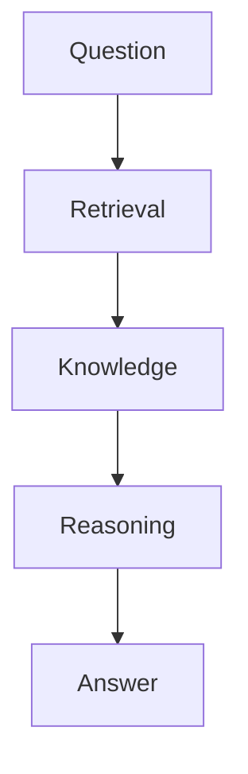

---

## Example

User Request:

```text
Summarize our internal AI governance policy.
```

Agent Process:

1. Retrieve policy documents
2. Analyze content
3. Generate summary

---

## Best Use Cases

* Enterprise knowledge assistants
* Policy management
* Document analysis

---

# Pattern 7: Planning-Based Reasoning

## Definition

The agent creates a plan before execution.

---

## Workflow

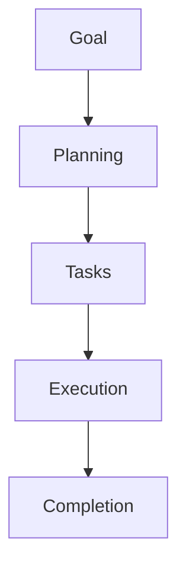

---

## Example

Goal:

```text
Prepare a quarterly technology strategy report.
```

Plan:

1. Gather market data
2. Analyze trends
3. Create recommendations
4. Generate report

---

## Best Use Cases

* Project management
* Research workflows
* Enterprise operations

---

# Pattern 8: Multi-Agent Collaborative Reasoning

## Definition

Multiple agents reason together to solve complex problems.

---

## Workflow

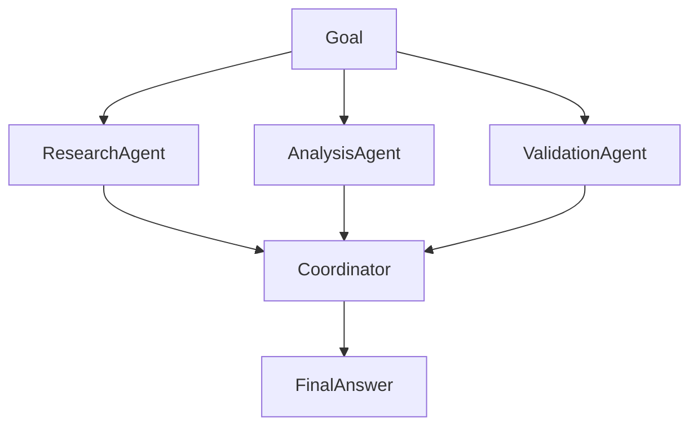

---

## Example

Business Strategy Assessment:

| Agent            | Responsibility         |
| ---------------- | ---------------------- |
| Research Agent   | Gather information     |
| Analysis Agent   | Evaluate findings      |
| Validation Agent | Verify recommendations |

---

## Advantages

* Specialized expertise
* Improved quality
* Better scalability

---

# Reasoning Pattern Selection Guide

| Scenario                    | Recommended Pattern   |
| --------------------------- | --------------------- |
| FAQ Systems                 | Direct Reasoning      |
| Root Cause Analysis         | Chain-of-Thought      |
| Strategic Decisions         | Tree-of-Thought       |
| Tool-Based Workflows        | ReAct                 |
| Quality Reviews             | Reflection            |
| Enterprise Knowledge Search | Retrieval-Augmented   |
| Complex Projects            | Planning-Based        |
| Enterprise Automation       | Multi-Agent Reasoning |

---

# Combining Reasoning Patterns

Modern enterprise agents rarely use a single reasoning pattern.

Example:

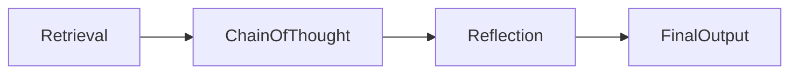

This combination provides:

* Knowledge grounding
* Structured reasoning
* Self-validation

---

# Enterprise Reasoning Framework

A production AI Agent typically follows:

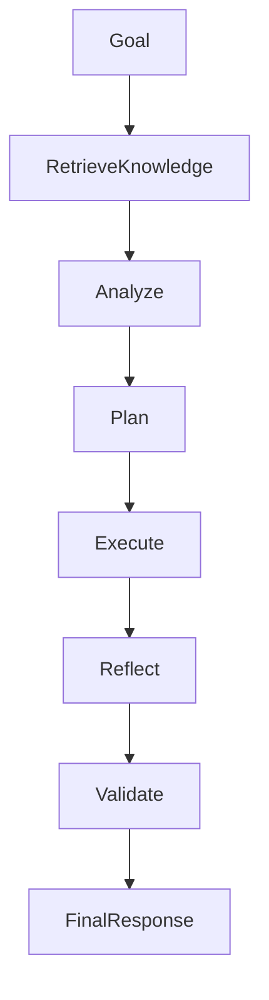

---

# Measuring Reasoning Quality

Organizations should evaluate:

| Metric                  | Description               |
| ----------------------- | ------------------------- |
| Logical Consistency     | Internal coherence        |
| Decision Accuracy       | Correct recommendations   |
| Plan Quality            | Effectiveness of planning |
| Reflection Score        | Quality of self-review    |
| Tool Selection Accuracy | Appropriate tool usage    |
| Success Rate            | Goal achievement          |

---

# Common Reasoning Failures

## Premature Conclusions

Insufficient analysis before responding.

---

## Missing Alternatives

Failure to evaluate multiple options.

---

## Tool Misuse

Incorrect tool selection.

---

## Context Ignorance

Ignoring relevant information.

---

## Weak Validation

Lack of review before action.

---

# Best Practices

## Use Structured Planning

Break complex tasks into smaller steps.

---

## Validate Assumptions

Verify information before acting.

---

## Combine Multiple Patterns

Use retrieval, planning, and reflection together.

---

## Include Self-Review

Allow agents to assess outputs.

---

## Measure Reasoning Performance

Track quality metrics continuously.

---

# Future of Agent Reasoning

Future AI Agents will demonstrate increasingly sophisticated reasoning capabilities.

Emerging trends include:

* Autonomous planning systems
* Self-improving reasoning
* Dynamic strategy generation
* Multi-agent collaboration
* Long-term goal management
* Continuous learning loops

Future enterprise agents will increasingly resemble human knowledge workers capable of planning, analyzing, collaborating, and adapting to changing business environments.

---

# Key Takeaways

Reasoning is the foundation of intelligent agent behavior.

Different reasoning patterns are suited to different tasks:

* Direct Reasoning for simple responses
* Chain-of-Thought for structured analysis
* Tree-of-Thought for decision-making
* ReAct for tool usage
* Reflection for quality improvement
* Retrieval-Augmented Reasoning for knowledge-intensive tasks
* Planning-Based Reasoning for complex workflows
* Multi-Agent Reasoning for large-scale enterprise systems

Selecting the appropriate reasoning pattern is one of the most important architectural decisions when designing AI Agents.
